[icon_build]:./../../doc/stuff/build_passing.svg

# APP - Bluetooth: Dual-Mode HID ![Build result][icon_build]
---------------

代码工程：`apps\hid\board\bd29\AC631X_hid.cbp`

## 1.APP 概述

### 1.1.配置双模描述

* 配置双模使能配置
```C
 #define TCFG_USER_BLE_ENABLE 1 //BLE 功能使能
 #define TCFG_USER_EDR_ENABLE 1 //EDR 功能使能
```
* 支持双模 HID 设备切换处理
```C
static void app_select_btmode(u8 mode)
{
    if (mode != HID_MODE_INIT)
    {
        if (bt_hid_mode == mode)
        {
            return;
        }
        bt_hid_mode = mode;
    }
    else
    {
        //init start
    }
```
* 支持进入省电低功耗 Sleep
```C
//*********************************************************************************//
// 低功耗配置 //
//*********************************************************************************//
// #define TCFG_LOWPOWER_POWER_SEL PWR_DCDC15//
#define TCFG_LOWPOWER_POWER_SEL PWR_LDO15//
#define TCFG_LOWPOWER_BTOSC_DISABLE 0
#define TCFG_LOWPOWER_LOWPOWER_SEL SLEEP_EN
#define TCFG_LOWPOWER_VDDIOM_LEVEL VDDIOM_VOL_30V
#define TCFG_LOWPOWER_VDDIOW_LEVEL VDDIOW_VOL_24V
#define TCFG_LOWPOWER_OSC_TYPE OSC_TYPE_LRC
```
* 支持进入软关机，可用 IO 触发唤醒
```C
struct port_wakeup port0 = {
.pullup_down_enable = ENABLE, //配置 I/O 内部上下拉是否使能
.edge = FALLING_EDGE, //唤醒方式选择,可选：上升沿\下降沿
.attribute = BLUETOOTH_RESUME, //保留参数
.iomap = IO_PORTB_01, //唤醒口选择
.filter_enable = ENABLE,
};
static void hid_set_soft_poweroff(void)
{
log_info("hid_set_soft_poweroff\n");
is_hid_active = 1;
```
* 系统事件处理函数
```C
 static int event_handler(struct application *app, struct sys_event *event)
 {
```
### 1.2.经典蓝牙 EDR 模式的 HID 接口列表

#### 1.2.1 代码文件 `hid_user.c`

#### 1.2.2 接口说明

    user_hid_set_icon 配置显示的图标
    user_hid_set_ReportMap 配置描述符 report 表
    user_hid_init 模块初始化
    user_hid_exit 模块初退出
    user_hid_enable 模块开关使能
    user_hid_disconnect 断开连接
    user_hid_msg_handler 协议栈事件处理
    user_hid_send_data 发送数据接口
    user_hid_send_ok_callback 协议栈发送完成回调，用来触发继续发数


### 1.3.经典蓝牙 EDR 模式的 HID 接口列表

#### 1.3.1 代码文件 `le_hogp.c`
* hogp 的 profile 的数据表放在 le_hogp.h；用户可用工具 make_gatt_services 自定义修改,重新配置 GATT 服务和属性等。

#### 1.3.2 接口说明

    le_hogp_set_icon 配置显示图标
    le_hogp_set_ReportMap 配置描述符 report 表
    bt_ble_init 模块初始化
    bt_ble_exit 模块初退出
    ble_module_enable 模块开关使能
    ble_disconnect 断开连接
    cbk_packet_handler 协议栈事件处理
    cbk_sm_packet_handler 配对加密事件处理
    advertisements_setup_init 广播参数
    make_set_adv_data Adv 包数据组建
    make_set_rsp_data Rsp 包数据组建
    set_adv_enable 广播开关
    check_connetion_updata_deal 连接参数调整流程
    att_read_callback ATT 读事件处理
    att_write_callback ATT 写事件处理
    app_send_user_data 发送数据接口
    app_send_user_data_check 检查是否可以往协议栈发送数据
    can_send_now_wakeup 协议栈发送完成回调，用来触发继续发数

## 2.APP 目录结构

 * 以鼠标 APP_MOUSE 为例子，SDK 的目录结构如图 1.1 所示。
 

## 3.板级配置

### 3.1 板级方案配置
 * 为提高开发过程的灵活性，HID_SDK 为用户提供几种不同的板级方案，用户可根据具体的开发需求选择相应的方案。
 * 板级方案配置文件的路径：apps/hid/board/BD29/board_config.h(hid 可替换为相应的 app 名称)。
 * 用户只需在板级方案配置文件 board_config.h 添加相应的宏定义，并包含相应的头文件，即可完成板级方案的配置。
```C
/*
 * 板级配置选择
*/
// #define CONFIG_BOARD_AC630X_DEMO
#define CONFIG_BOARD_AC6302A_MOUSE
// #define CONFIG_BOARD_AC6319A_MOUSE
// #define CONFIG_BOARD_AC6313_DEMO
// #define CONFIG_BOARD_AC6318_DEMO
```
### 3.2 板级配置文件
 * 板级配置文件的作用是实现相同系列不同封装的配置方案，其存放路径为：apps/hid/board/BD29(hid替换为相应的 app 名称)。板级配置文件对应一个 C 文件和一个 H 文件。
 * H 文件：板级配置的 H 文件包含了所有板载设备的配置信息，方便用户对具体的设备配置信息进行修改。
 * C 文件：板级配置的 C 文件的作用是根据 H 文件包含的板载配置信息，对板载设备进行初始化。

### 3.2 板级初始化

 - 系统将调用 C 文件中的 board_init()函数对板载设备进行初始化。板级初始化流程如图 1.3 所示。 用户可以根据开发需求在board_devices_init()函数中添加板载设备的初始化函数。

 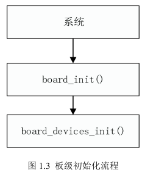

## 4.APP 开发框架

### 4.1 APP 总体框架

 - HID_SDK 为用户提供一种基于事件处理机制的 APP 开发框架，用户只需基于该框架添加需要处理的事件及事件处理函数，即可按照应用需求完成相应的开发。APP 总体框架如图 1.4 所示。
 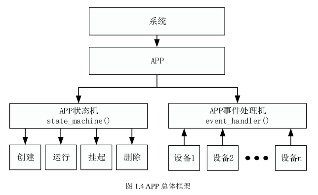

 * APP 状态机
系统在运行过程中，可以通过 APP 状态机对其状态进行切换，其状态包括创建、运行、挂起、删除。
 * APP 事件处理机
APP 是基于事件处理机制来运行的。系统在运行过程中，硬件设备的产生的数据将会以事件的形式反馈至系统的全局事件列表，系统将调度 APP 的事件处理机运行相应的事件处理函数对其进行处理。APP 的事件处理机的实现函数 apps/hid/app_mouse.c->event_handler()。处理流程如图1.5 所示。
 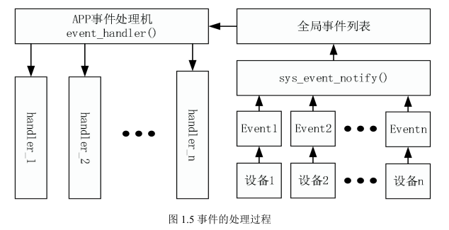

## 5.按键的使用

### 5.1 IOKEY 的使用

 * 配置说明
 IOKEY 参数 在板 级配置 文件 中（C 文件 和 H 文件 ）进 行配置 ，在 H 文件 中可 以打开TCFG_IOKEY_ENABLE 宏和结构配置（IO口和按键连接方式）相关参数，配置结构体参数说明如表 2-1 所示。
 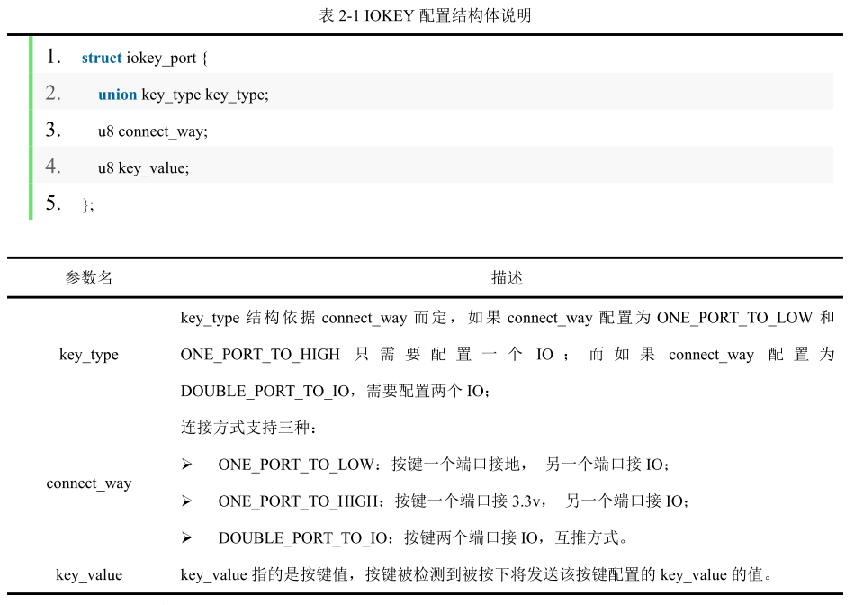

 * 配置示例
IOKEY 参数在板级配置文件中（c 文件和 h 文件）进行配置，配置示例如表 2-2 所示。
 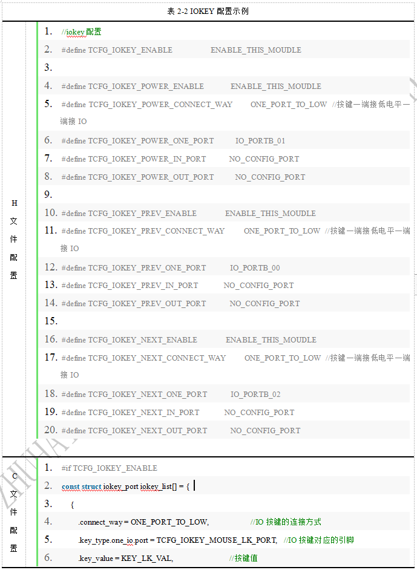

### 5.2 ADKEY 的使用

 * 配置说明
 ADKEY参数在板级配置文件中（c文件和h文件）进行配置，如board_ac6xxx_mouse.c和board_ac6xxx_mouse_cfg.h，在h文件中可以打开TCFG_ADKEY_ENABLE宏和结构配置（IO口和按键连接方式）相关参数，配置结构体参数说明如表2-3所示。
 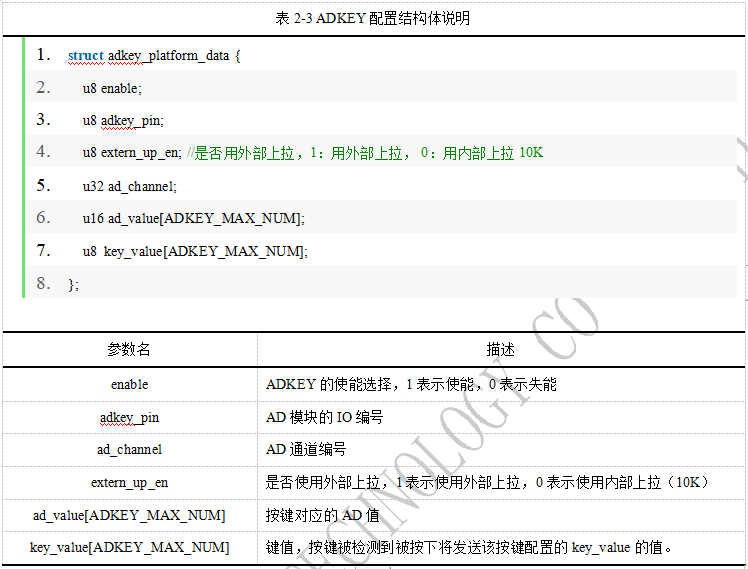

 * 配置示例
 ADKEY参数在板级配置文件中（c文件和h文件）进行配置，配置示例如表2-4所示。
 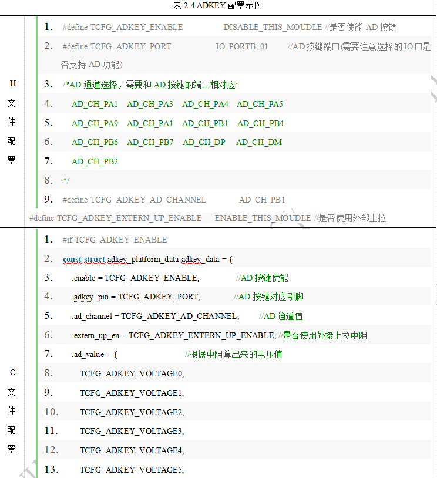

### 5.3 按键扫描参数配置
在IOKEY或者ADKEY使能后，按键扫描代码就会注册定时器定时扫描按键是否被按下，按键扫描参数可以在文件apps/common/key/iokey.c或adkey.c中配置，可供配置的参数表2-5所示。
 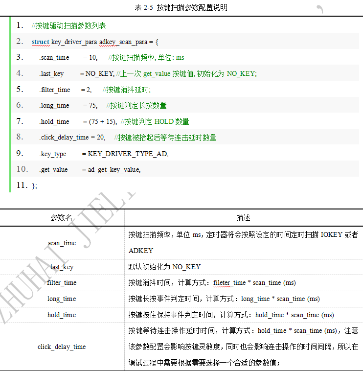

### 5.4 按键事件处理
目前在HID_SDK中实现了的一些按键通用事件如表2-6所示。
 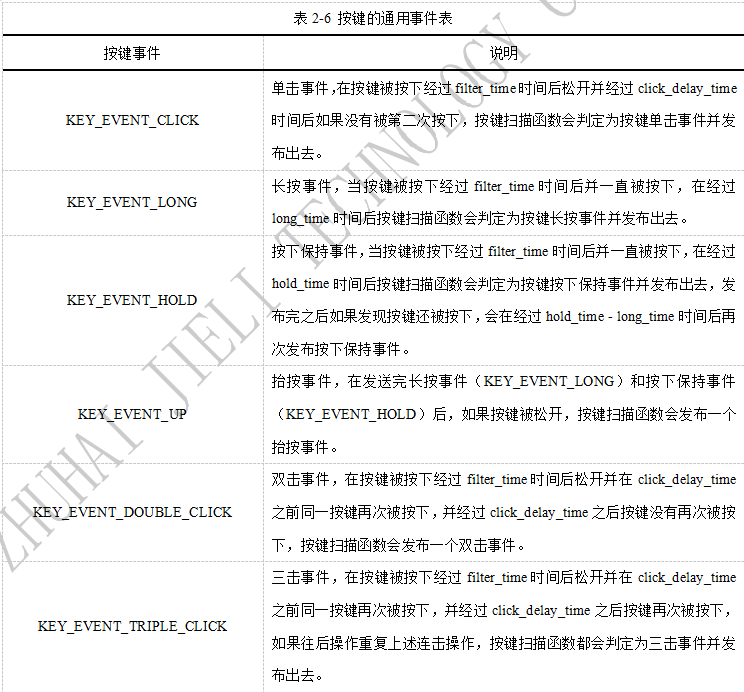

按键发布消息后，在 APP 将会收到该消息，APP 可以根据该按键消息进行相关处理，APP 的event_handler 收到的按键消息数据格式如表 2-7 所示。用户可以根据收到的按键消息进行相关处理操作。
 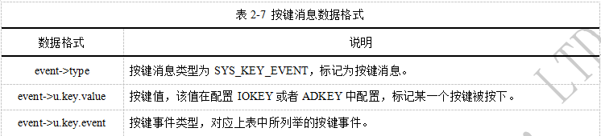

### 5.5 按键拓展功能
HID_SDK提供了一些通用按键配置和消息处理方式，如果这些通用的机制还不能满足用户的需求，用户可以通过修改配置使用按键的拓展功能。

 * 组合键功能
 HID_SDK的IOKEY中默认只支持单个按键的检测，用户如果需要支持组合按键，可以通过修改IOKEY的配置项来实现，具体实现如下：
  a、在配置文件的H文件中打开MULT_KEY_ENABLE宏，并添加组合键值。
  b、在配置文件的C文件中配置按键的重映射数据结构。
 配置示例如表2-8所示。
 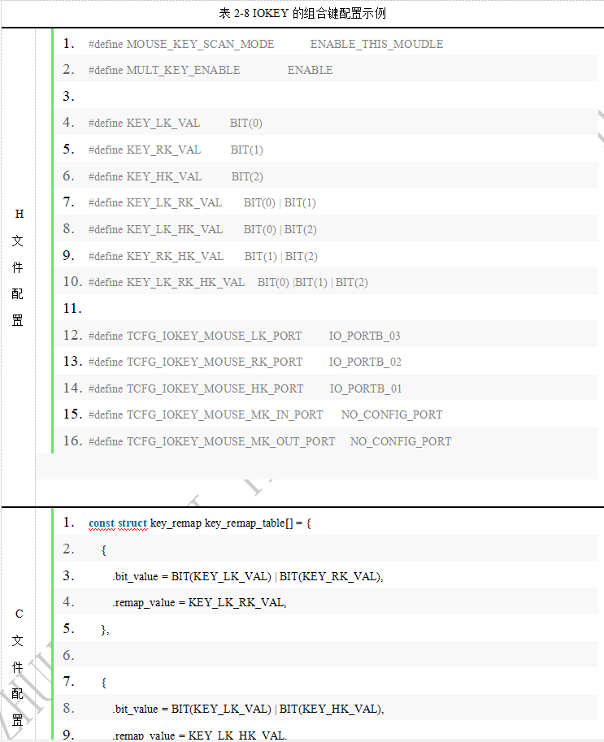

## 6.串口的使用
串口的初始化参数在板级配置文件中（c文件和h文件）进行配置，如board_ac6xxx_mouse.c和board_ac6xxx_mouse_cfg.h，在h文件中使能TCFG_UART0_ENABLE宏和结构配置相关参数，在C文件中添加初始化数据结构，配置示例如表2-9所示。串口初始化完成后，用户可调用apps/debug.c文件中的函数进行串口打印操作。
 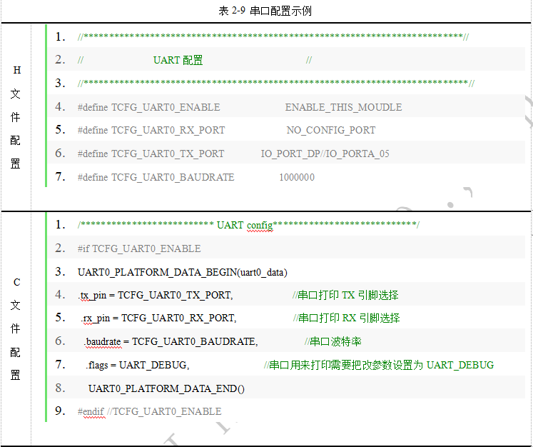

## 7.Mouse Report Map
Mouse Report Map定义与apps/common/ble/le_hogp.c文件内，如图3.1所示。
```C
static const u8 hid_report_map[] = {
    0x05, 0x01, 0x09, 0x02, 0xA1, 0x01, 0x85, 0x01, 0x09, 0x01, 0xA1, 0x00, 0x95, 0x05, 0x75,
    0x01, 0x05, 0x09, 0x19, 0x01, 0x29, 0x05, 0x15, 0x00, 0x25, 0x01, 0x81, 0x02, 0x95, 0x01,
    0x75, 0x03, 0x81, 0x01, 0x75, 0x08, 0x95, 0x01, 0x05, 0x01, 0x09, 0x38, 0x15, 0x81, 0x25,
    0x7F, 0x81, 0x06, 0x05, 0x0C, 0x0A, 0x38, 0x02, 0x95, 0x01, 0x81, 0x06, 0xC0, 0x85, 0x02,
    0x09, 0x01, 0xA1, 0x00, 0x75, 0x0C, 0x95, 0x02, 0x05, 0x01, 0x09, 0x30, 0x09, 0x31, 0x16,
    0x01, 0xF8, 0x26, 0xFF, 0x07, 0x81, 0x06, 0xC0, 0xC0, 0x05, 0x0C, 0x09, 0x01, 0xA1, 0x01,
    0x85, 0x03, 0x15, 0x00, 0x25, 0x01, 0x75, 0x01, 0x95, 0x01, 0x09, 0xCD, 0x81, 0x06, 0x0A,
    0x83, 0x01, 0x81, 0x06, 0x09, 0xB5, 0x81, 0x06, 0x09, 0xB6, 0x81, 0x06, 0x09, 0xEA, 0x81,
    0x06, 0x09, 0xE9, 0x81, 0x06, 0x0A, 0x25, 0x02, 0x81, 0x06, 0x0A, 0x24, 0x02, 0x81, 0x06,
    0x09, 0x05, 0x15, 0x00, 0x26, 0xFF, 0x00, 0x75, 0x08, 0x95, 0x02, 0xB1, 0x02, 0xC0
};
```
Mouse Report Map 的解析可通过在线解析工具实现，用户可根据需要对 Report Map 进行修改。
Report Map 在线解析工具地址： http://eleccelerator.com/usbdescreqparser/。

## 8.蓝牙鼠标 APP 总体框架
蓝牙鼠标 APP 总体框架如图 4.2 所示。
 

## 9.蓝牙鼠标功耗

 * 所用光学传感器资料
  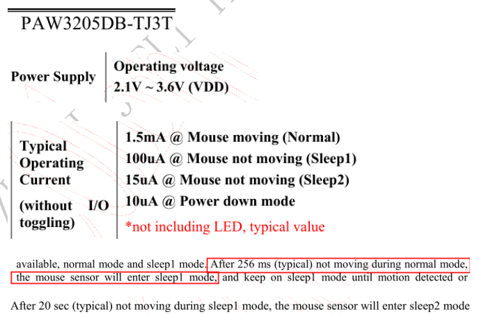

 * 测试条件
（1）ble连接状态下Interval：6*1.25 ms = 7.5ms，lantency：100。
（2）Radio TX:  7.2 dBm。
（3）DCDC；VDDIOM 3.0V；VDDIOW 2.4V。
（4）VDDIO和VBAT短接。

 * 芯片功耗
 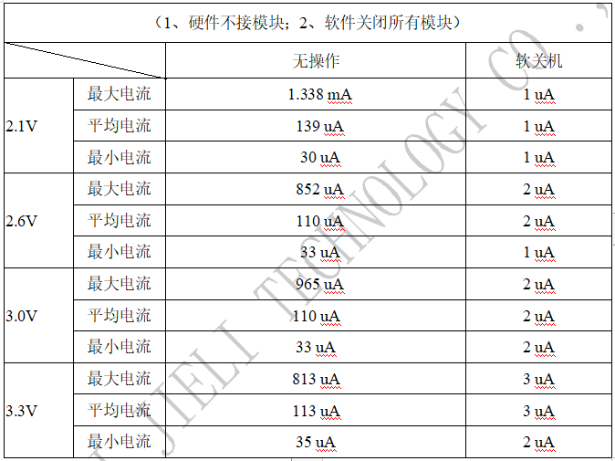

 * 整机功耗
 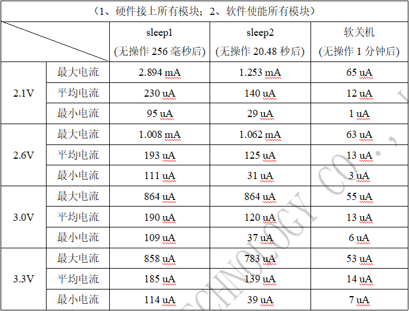
