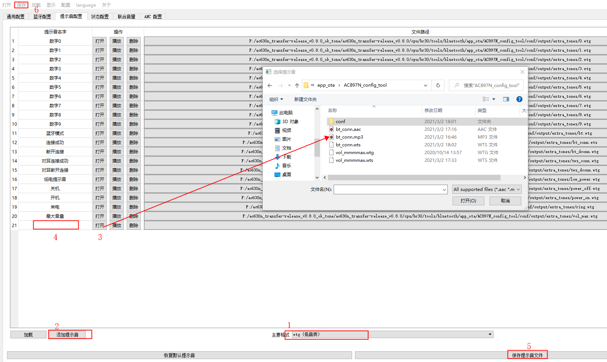

[icon_build]:./../../doc/stuff/build_passing.svg

# APP - Bluetooth: Dual-Mode HID ![Build result][icon_build]
---------------

代码工程：`apps\hid\board\bd29\AC631N_hid.cbp`

## 1.APP 概述
### 1.1 工程配置
* 板级配置选择

```C
#define CONFIG_BOARD_AC631N_DEMO       //CONFIG_APP_KEYBOARD,CONFIG_APP_PAGE_TURNER

#include "board_ac631n_demo_cfg.h"

```

* apps example 选择,只能选1个,要配置对应的board_config.h
```C
#define CONFIG_APP_KEYBOARD                 1//hid按键 ,default case
#define CONFIG_APP_KEYFOB                   0//自拍器,  board_ac6368a,board_6318,board_6379b
#define CONFIG_APP_MOUSE_SINGLE             0//单模切换
#define CONFIG_APP_MOUSE_DUAL               0//同时开双模
#define CONFIG_APP_STANDARD_KEYBOARD        0//标准HID键盘,board_ac6351d
#define CONFIG_APP_KEYPAGE                  0//翻页器
#define CONFIG_APP_GAMEBOX                  0//吃鸡王座
#define CONFIG_APP_REMOTE_CONTROL           0//语音遥控
#define CONFIG_APP_IDLE                     0//IDLE
```
### 1.2.配置双模描述

* 配置双模使能配置
```C
 #define TCFG_USER_BLE_ENABLE 1 //BLE 功能使能
 #define TCFG_USER_EDR_ENABLE 1 //EDR 功能使能
```

* 配置 app 选择
```C
1. ///app case 选择,只选 1,要配置对应的 board_config.h
2. #define CONFIG_APP_MOUSE_SINGLE 1//单模切换#de
```

蓝牙的 BLE 配置，保护 GATT 和 SM 的配置
```C
1. //蓝牙BLE配置
2. #define CONFIG_BT_GATT_COMMON_ENABLE 1 //配置使用gatt公共模块
3. #define CONFIG_BT_SM_SUPPORT_ENABLE 1 //配置是否支持加密
4. #define CONFIG_BT_GATT_CLIENT_NUM 0 //配置主机client个数(app not support)
5. #define CONFIG_BT_GATT_SERVER_NUM 1 //配置从机server个数
6. #define CONFIG_BT_GATT_CONNECTION_NUM (CONFIG_BT_GATT_SERVER_NUM + CONFIG_BT_GATT_CLIENT_NUM) //配置连接个数
```

* 模式选择， 配置 BLE 或 2.4G 模式；若选择 2.4G 配对码必须跟对方的配对码一致
```C
1. //2.4G 模式: 0---ble, 非 0---2.4G 配对码
2. #define CFG_RF_24G_CODE_ID (0) //<=24bits
```

* 支持双模 HID 设备切换处理
```C
1. static void app_select_btmode(u8 mode)
2. {
3. if (mode != HID_MODE_INIT) {
4. if (bt_hid_mode == mode) {
5. return;
6. }
7. bt_hid_mode = mode;
8. } else {
9. //init start
10. }
```

* 支持进入省电低功耗 Sleep
```C
//*********************************************************************************//
// 低功耗配置 //
//*********************************************************************************//
#define TCFG_LOWPOWER_POWER_SEL				PWR_DCDC15//
// #define TCFG_LOWPOWER_POWER_SEL				PWR_LDO15//
#define TCFG_LOWPOWER_BTOSC_DISABLE			0
#define TCFG_LOWPOWER_LOWPOWER_SEL			SLEEP_EN
#define TCFG_LOWPOWER_VDDIOM_LEVEL			VDDIOM_VOL_30V
#define TCFG_LOWPOWER_VDDIOW_LEVEL			VDDIOW_VOL_28V
#define TCFG_LOWPOWER_OSC_TYPE              OSC_TYPE_LRC
```

* 支持进入软关机，可用 IO 触发唤醒
```C
struct port_wakeup port0 = {
	.pullup_down_enable = ENABLE,                            //配置I/O 内部上下拉是否使能
	.edge               = FALLING_EDGE,                      //唤醒方式选择,可选：上升沿\下降沿
	.attribute          = BLUETOOTH_RESUME,                  //保留参数
	.iomap              = TCFG_ADKEY_PORT,                   //唤醒口选择
    .filter_enable      = ENABLE,
};
void hid_set_soft_poweroff(void)
{
    log_info("hid_set_soft_poweroff\n");
    is_hid_active = 1;
```

* 系统事件处理函数
```C
 static int event_handler(struct application *app, struct sys_event *event)
 {
```

* 增加配对绑定管理
```C
1. //2.4 开配对管理,可自己修改按键方式
2. #define DOUBLE_KEY_HOLD_PAIR (1 & CFG_RF_24G_CODE_ID) //中键+右键 长按数秒,进入 2.4G配对模式
3. #define DOUBLE_KEY_HOLD_CNT (4) //长按中键计算次数 >= 4s
```

* 进出低功耗函数
```C
1. void sleep_enter_callback(u8 step)
2. {
3. /*此函数禁止添加打印*/
4. if (step == 1) {
5. putchar('<');
6. APP_IO_DEBUG_1(A, 5);
7. /*dac_power_off();*/
8. } else {
9. close_gpio();
10. }
11. }
12.
13. void sleep_exit_callback(u32 usec)
14. {
15. 	putchar('>');
16. 	APP_IO_DEBUG_0(A, 5);
17. }
```
可以用来统计低功耗 sleep 的时间。

## 2.APP 目录结构

 * 以鼠标 APP_MOUSE 为例子，SDK 的目录结构如图 1.1 所示。
 

## 3.板级配置

### 3.1 板级方案配置
 * 为提高开发过程的灵活性，HID_SDK 为用户提供几种不同的板级方案，用户可根据具体的开发需求选择相应的方案。SDK
 在上一版的基础上基于BR23增加标准键盘的应用。
 * 板级方案配置文件的路径：apps/hid/board/BD29/board_config.h(hid 可替换为相应的 app 名称)。
 * 用户只需在板级方案配置文件 board_config.h 添加相应的宏定义，并包含相应的头文件，即可完成板级方案的配置。
```C
/*
 * 板级配置选择
*/
#define CONFIG_BOARD_AC631N_DEMO       // CONFIG_APP_KEYBOARD,CONFIG_APP_PAGE_TURNER
```
### 3.2 板级配置文件
 * 板级配置文件的作用是实现相同系列不同封装的配置方案，其存放路径为：apps/hid/board/BD29(hid替换为相应的 app 名称)。板级配置文件对应一个 C 文件和一个 H 文件。
 * H 文件：板级配置的 H 文件包含了所有板载设备的配置信息，方便用户对具体的设备配置信息进行修改。
 * C 文件：板级配置的 C 文件的作用是根据 H 文件包含的板载配置信息，对板载设备进行初始化。

### 3.2 板级初始化

 - 系统将调用 C 文件中的 board_init()函数对板载设备进行初始化。板级初始化流程如图 1.3 所示。 用户可以根据开发需求在board_devices_init()函数中添加板载设备的初始化函数。

 

## 4.APP 开发框架

### 4.1 APP 总体框架

 - HID_SDK 为用户提供一种基于事件处理机制的 APP 开发框架，用户只需基于该框架添加需要处理的事件及事件处理函数，即可按照应用需求完成相应的开发。APP 总体框架如图 1.4 所示。
 

 * APP 状态机
系统在运行过程中，可以通过 APP 状态机对其状态进行切换，其状态包括创建、运行、挂起、删除。
 * APP 事件处理机
APP 是基于事件处理机制来运行的。系统在运行过程中，硬件设备的产生的数据将会以事件的形式反馈至系统的全局事件列表，系统将调度 APP 的事件处理机运行相应的事件处理函数对其进行处理。APP 的事件处理机的实现函数 apps/hid/app_mouse.c->event_handler()。处理流程如图1.5 所示。
 

## 5.按键的使用

### 5.1 IOKEY 的使用

 * 配置说明
 IOKEY 参数 在板 级配置 文件 中（C 文件 和 H 文件 ）进 行配置 ，在 H 文件 中可 以打开TCFG_IOKEY_ENABLE 宏和结构配置（IO口和按键连接方式）相关参数，配置结构体参数说明如表 2-1 所示。
 

 * 配置示例
IOKEY 参数在板级配置文件中（c 文件和 h 文件）进行配置，配置示例如表 2-2 所示。
 

### 5.2 ADKEY 的使用

 * 配置说明
 ADKEY参数在板级配置文件中（c文件和h文件）进行配置，如board_ac6xxx_mouse.c和board_ac6xxx_mouse_cfg.h，在h文件中可以打开TCFG_ADKEY_ENABLE宏和结构配置（IO口和按键连接方式）相关参数，配置结构体参数说明如表2-3所示。
 

 * 配置示例
 ADKEY参数在板级配置文件中（c文件和h文件）进行配置，配置示例如表2-4所示。
 

### 5.3 按键扫描参数配置
在IOKEY或者ADKEY使能后，按键扫描代码就会注册定时器定时扫描按键是否被按下，按键扫描参数可以在文件apps/common/key/iokey.c或adkey.c中配置，可供配置的参数表2-5所示。
 

### 5.4 按键事件处理
目前在HID_SDK中实现了的一些按键通用事件如表2-6所示。
 

按键发布消息后，在 APP 将会收到该消息，APP 可以根据该按键消息进行相关处理，APP 的event_handler 收到的按键消息数据格式如表 2-7 所示。用户可以根据收到的按键消息进行相关处理操作。
 

### 5.5 按键拓展功能
HID_SDK提供了一些通用按键配置和消息处理方式，如果这些通用的机制还不能满足用户的需求，用户可以通过修改配置使用按键的拓展功能。

 * 组合键功能
 HID_SDK的IOKEY中默认只支持单个按键的检测，用户如果需要支持组合按键，可以通过修改IOKEY的配置项来实现，具体实现如下：
  a、在配置文件的H文件中打开MULT_KEY_ENABLE宏，并添加组合键值。
  b、在配置文件的C文件中配置按键的重映射数据结构。
 配置示例如表2-8所示。
 

## 6.串口的使用
* 串口的初始化参数在板级配置文件中（c文件和h文件）进行配置，如board_ac6xxx_mouse.c和board_ac6xxx_mouse_cfg.h，在h文件中使能TCFG_UART0_ENABLE宏和结构配置相关参数，在C文件中添加初始化数据结构，配置示例如表2-9所示。串口初始化完成后，用户可调用apps/debug.c文件中的函数进行串口打印操作。
 

## 7.Mouse Report Map
* Mouse Report Map定义与apps/common/ble/le_hogp.c文件内，如图3.1所示。
```C
static const u8 mouse_report_map[]
    0x05, 0x01,        // Usage Page (Generic Desktop Ctrls)
    0x09, 0x02,        // Usage (Mouse)
    0xA1, 0x01,        // Collection (Application)
    0x85, 0x01,        //   Report ID (1)
    0x09, 0x01,        //   Usage (Pointer)
    0xA1, 0x00,        //   Collection (Physical)
    0x95, 0x05,        //     Report Count (5)
    0x75, 0x01,        //     Report Size (1)
    0x05, 0x09,        //     Usage Page (Button)
    0x19, 0x01,        //     Usage Minimum (0x01)
    0x29, 0x05,        //     Usage Maximum (0x05)
    0x15, 0x00,        //     Logical Minimum (0)
    0x25, 0x01,        //     Logical Maximum (1)
    0x81, 0x02,        //     Input (Data,Var,Abs,No Wrap,Linear,Preferred State,No Null Position)
    0x95, 0x01,        //     Report Count (1)
    0x75, 0x03,        //     Report Size (3)
    0x81, 0x01,        //     Input (Const,Array,Abs,No Wrap,Linear,Preferred State,No Null Position)
    0x75, 0x08,        //     Report Size (8)
    0x95, 0x01,        //     Report Count (1)
    0x05, 0x01,        //     Usage Page (Generic Desktop Ctrls)
    0x09, 0x38,        //     Usage (Wheel)
    0x15, 0x81,        //     Logical Minimum (-127)
    0x25, 0x7F,        //     Logical Maximum (127)
    0x81, 0x06,        //     Input (Data,Var,Rel,No Wrap,Linear,Preferred State,No Null Position)
    0x05, 0x0C,        //     Usage Page (Consumer)
    0x0A, 0x38, 0x02,  //     Usage (AC Pan)
    0x95, 0x01,        //     Report Count (1)
    0x81, 0x06,        //     Input (Data,Var,Rel,No Wrap,Linear,Preferred State,No Null Position)
    0xC0,              //   End Collection
    0x85, 0x02,        //   Report ID (2)
    0x09, 0x01,        //   Usage (Consumer Control)
    0xA1, 0x00,        //   Collection (Physical)
    0x75, 0x0C,        //     Report Size (12)
    0x95, 0x02,        //     Report Count (2)
    0x05, 0x01,        //     Usage Page (Generic Desktop Ctrls)
    0x09, 0x30,        //     Usage (X)
    0x09, 0x31,        //     Usage (Y)
    0x16, 0x01, 0xF8,  //     Logical Minimum (-2047)
    0x26, 0xFF, 0x07,  //     Logical Maximum (2047)
    0x81, 0x06,        //     Input (Data,Var,Rel,No Wrap,Linear,Preferred State,No Null Position)
    0xC0,              //   End Collection
    0xC0,              // End Collection
    0x05, 0x0C,        // Usage Page (Consumer)
    0x09, 0x01,        // Usage (Consumer Control)
    0xA1, 0x01,        // Collection (Application)
    0x85, 0x03,        //   Report ID (3)
    0x15, 0x00,        //   Logical Minimum (0)
    0x25, 0x01,        //   Logical Maximum (1)
    0x75, 0x01,        //   Report Size (1)
    0x95, 0x01,        //   Report Count (1)
    0x09, 0xCD,        //   Usage (Play/Pause)
    0x81, 0x06,        //   Input (Data,Var,Rel,No Wrap,Linear,Preferred State,No Null Position)
    0x0A, 0x83, 0x01,  //   Usage (AL Consumer Control Configuration)
    0x81, 0x06,        //   Input (Data,Var,Rel,No Wrap,Linear,Preferred State,No Null Position)
    0x09, 0xB5,        //   Usage (Scan Next Track)
    0x81, 0x06,        //   Input (Data,Var,Rel,No Wrap,Linear,Preferred State,No Null Position)
    0x09, 0xB6,        //   Usage (Scan Previous Track)
    0x81, 0x06,        //   Input (Data,Var,Rel,No Wrap,Linear,Preferred State,No Null Position)
    0x09, 0xEA,        //   Usage (Volume Decrement)
    0x81, 0x06,        //   Input (Data,Var,Rel,No Wrap,Linear,Preferred State,No Null Position)
    0x09, 0xE9,        //   Usage (Volume Increment)
    0x81, 0x06,        //   Input (Data,Var,Rel,No Wrap,Linear,Preferred State,No Null Position)
    0x0A, 0x25, 0x02,  //   Usage (AC Forward)
    0x81, 0x06,        //   Input (Data,Var,Rel,No Wrap,Linear,Preferred State,No Null Position)
    0x0A, 0x24, 0x02,  //   Usage (AC Back)
    0x81, 0x06,        //   Input (Data,Var,Rel,No Wrap,Linear,Preferred State,No Null Position)
    0x09, 0x05,        //   Usage (Headphone)
    0x15, 0x00,        //   Logical Minimum (0)
    0x26, 0xFF, 0x00,  //   Logical Maximum (255)
    0x75, 0x08,        //   Report Size (8)
    0x95, 0x02,        //   Report Count (2)
    0xB1, 0x02,        //   Feature (Data,Var,Abs,No Wrap,Linear,Preferred State,No Null Position,Non-volatile)
    0xC0,              // End Collection
    // 149 bytes
};
```
Mouse Report Map 的解析可通过在线解析工具实现，用户可根据需要对 Report Map 进行修改。
Report Map 在线解析工具地址： http://eleccelerator.com/usbdescreqparser/。

## 8.蓝牙鼠标 APP 总体框架
蓝牙鼠标 APP 总体框架如图 4.2 所示。
 
* 在apps/hid/app_mouse.c文件中包含了APP的注册信息，如图3.3所示，系统在初始化过程中将根据此信息完成该APP的注册。

```C
/*
 * 注册AT Module模式
 */
REGISTER_APPLICATION(app_mouse) = {
    .name 	= "mouse_single",
    .action	= ACTION_MOUSE_MAIN,
    .ops 	= &app_mouse_ops,
    .state  = APP_STA_DESTROY,
};

```
* 系统初始化完成后，系统将调度app_task任务，该任务调用apps/hid/app_main.c->app_main()函数，开始运行app_mouse。

* 事件的产生
鼠标的按键、旋转编码开关、光学感应器的数据采集在系统软件定时器的中断服务函数中完成，采集的数据将被打包为相应的事件周期性地上报至全局事件列表。
* 事件的处理
系统将调度APP的事件处理机（app_mouse.c->event_handler()）依据事件类型，调用相应的事件处理函数。
mouse_key_event_handler()、app_code_sw_event_handler()、app_optical_sensor_event_handler()位于apps/hid/app_mouse.c文件，分别用以处理按键事件、旋转编码开关事件、光学感应器事件，其事件包含的数据将被填入first_packet和second_packet中保存。
* 数据的发送
蓝牙设备初始化时，设置了一个系统的软件定时器，用以周期性地向蓝牙主设备发送mouse_packet_data数据，该系统定时器的中断服务函数为：
app/common/ble/le_hogp.c->hid_timer_mouse_handler()。


## 9.蓝牙鼠标功耗

 * 所用光学传感器资料
  

 * 测试条件
（1）ble连接状态下Interval：6*1.25 ms = 7.5ms，lantency：100。
（2）Radio TX:  7.2 dBm。
（3）DCDC；VDDIOM 3.0V；VDDIOW 2.4V。
（4）VDDIO和VBAT短接。

 * 芯片功耗
 

 * 整机功耗
 

# APP - Bluetooth DualMode Keyboard
## 1. 概述
本案例为基于HID的键盘设备，可以用来媒体播放，上下曲暂停音量的控制，支持安卓和IOS的双系统，并且支持BLE和EDR两种工作模式。
支持的板级： bd29、br25、br23、br30、bd19、br34
支持的芯片： AC631N、AC636N、AC635N、AC637N、AC632N、AC638N
## 2. 工程配置
代码工程：apps\hid\board\br23\AC635N_hid.cbp

* 先进行APP选择配置（apps\hid\include\app_config.h）
```C
//app case 选择,只选1,要配置对应的board_config.h
#define CONFIG_APP_KEYBOARD                 1//hid按键 ,default case
#define CONFIG_APP_KEYFOB                   0//自拍器,  board_ac6368a,board_6318,board_6379b
#define CONFIG_APP_MOUSE_SINGLE             0//单模切换
#define CONFIG_APP_MOUSE_DUAL               0//同时开双模
#define CONFIG_APP_STANDARD_KEYBOARD        0//标准HID键盘,board_ac6351d
#define CONFIG_APP_KEYPAGE                  0//翻页器
#define CONFIG_APP_GAMEBOX                  0//吃鸡王座
#define CONFIG_APP_REMOTE_CONTROL           0//语音遥控
#define CONFIG_APP_IDLE                     0//IDLE
```
* 配置板级board_config.h(apps\hid\board\bd29\board_config.h)，下面选择AC631n板级
```C
/*
 *  板级配置选择
 */
#define CONFIG_BOARD_AC631N_DEMO      //CONFIG_APP_KEYBOARD,CONFIG_APP_PAGE_TURNER
#include "board_ac631n_demo_cfg.h"

#endif
```
* 配置是否打开 edr 和ble模块
```C
7.#define TCFG_USER_BLE_ENABLE                      1   //BLE功能使能  
8.#define TCFG_USER_EDR_ENABLE                      1   //EDR功能使能
```
选择好对应的板级和APP后其他的设置及初始化按照默认设置，可以运行该APP。
## 3. 主要代码说明
### 3.1 APP注册运行
```C
#if(CONFIG_APP_KEYBOARD)
    it.name = "hid_key";
    it.action = ACTION_HID_MAIN;
#elif (CONFIG_APP_MOUSE_SINGLE)
    it.name = "mouse_single";
    it.action = ACTION_MOUSE_MAIN;
#elif (CONFIG_APP_MOUSE_DUAL)
    it.name = "mouse_dual";
    it.action = ACTION_MOUSE_DUAL_MAIN;
#elif(CONFIG_APP_KEYFOB)
    it.name = "keyfob";
    it.action = ACTION_KEYFOB;
#elif(CONFIG_APP_STANDARD_KEYBOARD)
    it.name = "standard_keyboard";
    it.action = ACTION_STANDARD_KEYBOARD;
#elif(CONFIG_APP_KEYPAGE)
    it.name = "keypage";
    it.action = ACTION_KEYPAGE;
#elif(CONFIG_APP_GAMEBOX)
    it.name = "gamebox";
    it.action = ACTION_GAMEBOX;
#elif(CONFIG_APP_REMOTE_CONTROL)
    it.name = "hid_vrc";
    it.action = ACTION_REMOTE_CONTROL;
#elif(CONFIG_APP_IDLE)
    it.name = "idle";
    it.action = ACTION_IDLE_MAIN;
#else
    while (1) {
        printf("no app!!!");
    }
#endif

    log_info("run app>>> %s", it.name);

    start_app(&it);
}
```
* 首先在app_main.c函数中添加hid_key应用分支，然后进行应用注册。
```C
1.REGISTER_APPLICATION(app_hid) = {  
2.    .name   = "hid_key",  
3.    .action = ACTION_HID_MAIN,  
4.    .ops    = &app_hid_ops,  
5.    .state  = APP_STA_DESTROY,  
6.};  
```
* 按照上述代码进行APP注册，执行配置好的app。之后进入APP_state_machine,根据状态机的不同状态执行不同的分支，第一次执行时进入APP_STA_CREATE分支，执行对应的app_start()。开始执行app_start()在该函数内进行时钟初始化，进行蓝牙模式选择，按键消息使能等一些初始化操作，其中按键使能使得系统在有外部按键事件发生时及时响应，进行事件处理。
```C
1.REGISTER_LP_TARGET(app_hid_lp_target) = {  
2.    .name = "app_hid_deal",  
3.    .is_idle = app_hid_idle_query,  
4.};   
5.static const struct application_operation app_hid_ops = {  
6.    .state_machine  = state_machine,  
7.    .event_handler  = event_handler,  
8.};  
```
键盘应用注册以后，进行以上的app_hid_ops进行处理。分为两个模块state_machine和event_handler。执行流程大致如下，对应函数位于app_keyboard.c文件：
state_machine()--->app_start()--->sys_key_event_enable()。主要根据应用的状态进行时钟初始化，蓝牙名设置，读取配置信息，消息按键使能等配置。
event_handler(struct application *app, struct sys_event *event)--->app_key_event_handler(sys_event *event)--->app_key_deal_test(key_type,key_value)---->ble_hid_key_deal_test(key_msg)。事件处理流程大致如上所示。Event_handler()根据传入的第二个参数事件类型，选择对应的处理分支，此处选择执行按键事件，然后调用按键事件处理函数根据事件的按键值和按键类型进行对应的事件处理。


### 3.2 APP事件处理机制
* 事件的产生与定义:
   
外部事件的数据采集在系统软件定时器的中断服务函数中完成，采集的数据将被打包为相应的 事件周期性地上报至全局事件列表。
```C
void sys_event_notify(struct sys_event *e)；
此函数为事件通知函数，系统有事件发生时调用。
```
* 事件的处理:

本案例中主要的事件处理包括连接事件处理、按键事件处理处理，事件处理函数的共同入口都是event_handler()之后调用不同的函数实现不同类型事件的响应处理。

   * 蓝牙连接事件处理:在APP运行以后，首先进行的蓝牙连接事件处理，进行蓝牙初始化，HID描述符解读，蓝牙模式选择等，。调用event_handler(),bt_connction_status_event_handler()函数实现蓝牙连接等事件。
   * 按键事件处理：通过event_handler()函数中调用app_key_event_handler()函数实现对按键事件的处理。

### 3.3 数据发送
* Mouse Report Map 定义与 apps/common/ble/le_hogp.c 文件内：
```C
1. 0x05, 0x01, // Usage Page (Generic Desktop Ctrls)
2. 0x09, 0x02, // Usage (Mouse)
3. 0xA1, 0x01, // Collection (Application)
4. 0x85, 0x01, // Report ID (1)
5. 0x09, 0x01, // Usage (Pointer)
6. 0xA1, 0x00, // Collection (Physical)
7. 0x95, 0x05, // Report Count (5)
8. 0x75, 0x01, // Report Size (1)
9. 0x05, 0x09, // Usage Page (Button)
10. 0x19, 0x01, // Usage Minimum (0x01)
11. 0x29, 0x05, // Usage Maximum (0x05)
12. 0x15, 0x00, // Logical Minimum (0)
13. 0x25, 0x01, // Logical Maximum (1)
...  
```
Mouse Report Map 的解析可通过在线解析工具实现，用户可根据需要对 Report Map 进行修改。
Report Map 在线解析工具地址： http://eleccelerator.com/usbdescreqparser/。


# APP - Bluetooth DualMode Keyfob
## 1. 概述
本案例主要用于蓝牙自拍器实现，进行以下配置后，打开手机蓝牙连接设备可进行对应的拍照操作。由于自拍器的使用会用到LED所以本案例也要对LED进行对应的设置，自拍器设备上电以后没有连接蓝牙之前，LED以一定的频率闪烁，直到连接或者是进入sleep模式时熄灭。蓝牙连接以后LED熄灭，只有按键按下的时候LED会同时接通过，可以通过LED的状态来判断自拍器的工作状态。
支持板级：bd29、br25、br30、bd19
支持芯片：AC6318、AC6368A、AC6379B、AC6328A
## 2. 工程配置
代码工程：apps\hid\board\br25\AC636N_hid.cbp

* 配置app选择(apps\hid\include\app_config.h),如下图选择对应的自拍器应用。
```C
//app case 选择,只选1,要配置对应的board_config.h
#define CONFIG_APP_KEYBOARD                 0//hid按键 ,default case
#define CONFIG_APP_KEYFOB                   1//自拍器,  board_ac6368a,board_6318,board_6379b
#define CONFIG_APP_MOUSE_SINGLE             0//单模切换
#define CONFIG_APP_MOUSE_DUAL               0//同时开双模
#define CONFIG_APP_STANDARD_KEYBOARD        0//标准HID键盘,board_ac6351d
#define CONFIG_APP_KEYPAGE                  0//翻页器
#define CONFIG_APP_GAMEBOX                  0//吃鸡王座
#define CONFIG_APP_REMOTE_CONTROL           0//语音遥控
#define CONFIG_APP_IDLE                     0//IDLE
```
* 先配置板级board_config.h(apps\hid\board\br25\board_config.h)，选择对应的开发板。
```C
//#define CONFIG_BOARD_AC636N_DEMO   // CONFIG_APP_KEYBOARD
// #define CONFIG_BOARD_AC6366C_DEMO   //
// #define CONFIG_BOARD_AC6368B_DEMO   //
// #define CONFIG_BOARD_AC6369C_DEMO   //
#define CONFIG_BOARD_AC6368A_KEYFOB   // CONFIG_APP_KEYFOB
// #define CONFIG_BOARD_AC6369F_MOUSE    // CONFIG_APP_MOUSE
// #define CONFIG_BOARD_AC6363F_MOUSE    // CONFIG_APP_MOUSE_XXX

#include "board_ac636n_demo_cfg.h"
#include "board_ac6366c_demo_cfg.h"
#include "board_ac6368b_demo_cfg.h"
#include "board_ac6369c_demo_cfg.h"
#include "board_ac6368a_keyfob_cfg.h"
#include "board_ac6369f_mouse_cfg.h"
#include "board_ac6363f_mouse_cfg.h"
```
* 板级配置board_ac6368a_keyfob_cfg.h
```C
1.//*********************************************************************************//  
2.//                                  LED 配置                                       //  
3.//*********************************************************************************//  
4.#define TCFG_PWMLED_ENABLE                  ENABLE_THIS_MOUDLE          //是否支持IO推灯模块,bd29没有PWM模块  
5.#define TCFG_PWMLED_IO_PUSH                 ENABLE                             //LED使用的IO 推灯  
6.#define TCFG_PWMLED_IOMODE                  LED_ONE_IO_MODE             //LED模式，单IO还是两个IO 
7.#define TCFG_PWMLED_PIN                        IO_PORTB_01                      //LED使用的IO口  
```
*  //配置是否打开 edr 和ble模块
```C
9.#define TCFG_USER_BLE_ENABLE                     0   //BLE功能使能  
10.#define TCFG_USER_EDR_ENABLE                    1   //EDR功能使能
```
## 3. 主要代码说明
### 3.1 APP注册运行
```C
1.REGISTER_LP_TARGET(app_hid_lp_target) = {  
2.    .name = "app_hid_deal",  
3.    .is_idle = app_hid_idle_query,  
4.};  
5.  
6.static const struct application_operation app_hid_ops = {  
7.    .state_machine  = state_machine,  
8.    .event_handler  = event_handler,  
9.};  
10./* 
11. * 注册AT Module模式 
12. */  
13.REGISTER_APPLICATION(app_hid) = {  
14.    .name   = "keyfob",  
15.    .action = ACTION_KEYFOB,  
16.    .ops    = &app_hid_ops,  
17.    .state  = APP_STA_DESTROY,  
18.}; 
```
按照上述代码进行APP注册，执行配置好的app。之后进入APP_state_machine,根据状态机的不同状态执行不同的分支，第一次执行时进入APP_STA_CREATE分支，执行对应的app_start()。开始执行app_start()在该函数内进行时钟初始化，进行蓝牙模式选择，按键消息使能等一些初始化操作，其中按键使能使得系统在有外部按键事件发生时及时响应，进行事件处理。
### 3.2 APP事件处理机制
* 事件的产生与定义:
外部事件的数据采集在系统软件定时器的中断服务函数中完成，采集的数据将被打包为相应的 事件周期性地上报至全局事件列表。
```C
 void sys_event_notify(struct sys_event *e)；
此函数为事件通知函数，系统有事件发生时调用。
```
* 事件的处理:
本案例中主要的事件处理包括连接事件处理、按键事件处理和LED事件处理，事件处理函数的共同入口都是event_handler().之后调用不同的函数实现不同类型事件的响应处理。
* 蓝牙连接事件处理:
在APP运行以后，首先进行的蓝牙连接事件处理，进行蓝牙初始化，HID描述符解读，蓝牙模式选择等，函数的第二个参数根据事件的不同，传入不同的事件类型，执行不同分支，如下：
```C
static int keyfob_event_handler(struct application *app, struct sys_event *event)
{

#if (TCFG_HID_AUTO_SHUTDOWN_TIME)
    //重置无操作定时计数
    if (event->type != SYS_DEVICE_EVENT || DEVICE_EVENT_FROM_POWER != event->arg) { //过滤电源消息
        sys_timer_modify(g_auto_shutdown_timer, TCFG_HID_AUTO_SHUTDOWN_TIME * 1000);
    }
#endif

    bt_comm_edr_sniff_clean();

    /* log_info("event: %s", event->arg); */
    switch (event->type) {
    case SYS_KEY_EVENT:
        /* log_info("Sys Key : %s", event->arg); */
        app_keyfob_event_handler(event);
        return 0;
```
* 以下图为蓝牙连接事件处理函数，进行蓝牙初始化以及模式选择。
```C
1.static int bt_connction_status_event_handler(struct bt_event *bt)  
2.{  
3.  
4.    log_info("-----------------------bt_connction_status_event_handler %d", bt->event);  
5.  
6.    switch (bt->event) {  
7.    case BT_STATUS_INIT_OK:  
8.        /* 
9.         * 蓝牙初始化完成 
```
调用keyfob_event_handler()，bt_connction_status_event_handler()函数实现蓝牙连接等事件。

* 按键事件处理和LED事件处理

通过调用app_key_event_handler()函数进入按键事件处理流程，根据按键的类型和按键值进入app_key_deal_test()和key_value_send()函数进行事件处理。
```C
1.static void app_key_event_handler(struct sys_event *event)  
2.{  
3.    /* u16 cpi = 0; */  
4.    u8 event_type = 0;  
5.    u8 key_value = 0;  
6.  
7.    if (event->arg == (void *)DEVICE_EVENT_FROM_KEY) {  
8.        event_type = event->u.key.event;  
9.        key_value = event->u.key.value;  
10.        printf("app_key_evnet: %d,%d\n", event_type, key_value);  
11.        app_key_deal_test(event_type, key_value);  
12.    }  
13.}  

1.static void app_key_deal_test(u8 key_type, u8 key_value)  
2.{  
3.    u16 key_msg = 0;  
4.  
5.#if TCFG_USER_EDR_ENABLE  
6.    if (!edr_hid_is_connected()) {  
7.        if (bt_connect_phone_back_start(1)) { //回连  
8.            return;  
9.        }  
10.    }  
```
* 下图为LED工作状态部分实现函数。
```C
static void led_on_off(u8 state, u8 res)
{
    /* if(led_state != state || (state == LED_KEY_HOLD)){ */
    if (1) { //相同状态也要更新时间
        u8 prev_state = led_state;
        log_info("led_state: %d>>>%d", led_state, state);
        led_state = state;
        led_io_flash = 0;
```
### 3.3 数据发送
KEYFOB属于HID设备范畴，数据的定义与发送要根据HID 设备描述符的内容进行确定，由下图的描述符可知，该描述符是一个用户自定义描述符，可以组合实现各种需要的功能，一共有两个Input实体描述符。其中每个功能按键对应一个bit,一共11bit,剩余一个13bit 的常数输入实体，所以自定义描述符的数据包长度位3byte.如果用户需要在自拍器的基础上增加不同按键类型的事件，可以在下面的描述符中先添加该功能，然后在按键处理函数分支进行对应的按键值和按键类型的设置，来实现对应的功能。
用户自定义的描述符组成本案例的KEYFOB描述符，实现对应的按键功能。
```C
static const u8 keyfob_report_map[] = {
    //通用按键
    0x05, 0x0C,        // Usage Page (Consumer)
    0x09, 0x01,        // Usage (Consumer Control)
    0xA1, 0x01,        // Collection (Application)
    0x85, 0x03,        //   Report ID (3)
    0x15, 0x00,        //   Logical Minimum (0)
    0x25, 0x01,        //   Logical Maximum (1)
    0x75, 0x01,        //   Report Size (1)
    0x95, 0x0B,        //   Report Count (11)
    0x0A, 0x23, 0x02,  //   Usage (AC Home)
    0x0A, 0x21, 0x02,  //   Usage (AC Search)
    0x0A, 0xB1, 0x01,  //   Usage (AL Screen Saver)
    0x09, 0xB8,        //   Usage (Eject)
    0x09, 0xB6,        //   Usage (Scan Previous Track)
    0x09, 0xCD,        //   Usage (Play/Pause)
    0x09, 0xB5,        //   Usage (Scan Next Track)
    0x09, 0xE2,        //   Usage (Mute)
    0x09, 0xEA,        //   Usage (Volume Decrement)
    0x09, 0xE9,        //   Usage (Volume Increment)
    0x09, 0x30,        //   Usage (Power)
    0x0A, 0xAE, 0x01,  //   Usage (AL Keyboard Layout)
    0x81, 0x02,        //   Input (Data,Var,Abs,No Wrap,Linear,Preferred State,No Null Position)
    0x95, 0x01,        //   Report Count (1)
    0x75, 0x0D,        //   Report Size (13)
    0x81, 0x03,        //   Input (Const,Var,Abs,No Wrap,Linear,Preferred State,No Null Position)
    0xC0,              // End Collection

    // 119 bytes
};
```
* key_big_press/null表示自定义描述符中实现音量增加的按键按下和抬起的数据包。
```C
//mode >> 0：press + up，1：press，2：up
static void key_value_send(u8 key_value, u8 mode)
{
    void (*hid_data_send_pt)(u8 report_id, u8 * data, u16 len) = NULL;

    if (bt_hid_mode == HID_MODE_EDR) {
#if TCFG_USER_EDR_ENABLE
        hid_data_send_pt = edr_hid_data_send;
#endif
    } else {
#if TCFG_USER_BLE_ENABLE
        hid_data_send_pt = ble_hid_data_send;
#endif
    }

    if (!hid_data_send_pt) {
        return;
    }

    if (key_value == KEY_BIG_ID) {
        if (mode == 0 || mode == 1) {
            hid_data_send_pt(3, key_a_big_press, 3);
        }
        if (mode == 0 || mode == 2) {
            hid_data_send_pt(3, key_a_big_null, 3);
        }
    } else if (key_value == KEY_SMALL_ID) {
        if (mode == 0 || mode == 1) {
            /* hid_data_send_pt(1,key_b_small_press,8); */
            hid_data_send_pt(3, key_a_small_press, 3);
        }
        if (mode == 0 || mode == 2) {
            /* hid_data_send_pt(1,key_b_small_null,8); */
            hid_data_send_pt(3, key_a_small_null, 3);
        }
    }

}
```
# APP - Bluetooth DualMode KeyPage
## 1. 概述
本APP基于HID开发，主要用于浏览当下火爆的抖音等小视频的上下翻页、左右菜单切换、暂停等操作。首先选择需要用到的应用本案例选择，然后进行对应的支持板级选择，具体参考下文的步骤。通过软件编译下载到对应的开发板，打开手机蓝牙进行连接，进入视频浏览界面操作对应按键即可。
支持的板级： bd29、br25、br23、br30、bd19、br34
支持的芯片： AC631N、AC636N、AC635N、AC637N、AC638N
## 2. 工程配置
代码工程：apps\hid\board\br25\AC636N_hid.cbp

* app配置
```C
//app case 选择,只选1,要配置对应的board_config.h
#define CONFIG_APP_KEYBOARD                 0//hid按键 ,default case
#define CONFIG_APP_KEYFOB                   0//自拍器,  board_ac6368a,board_6318,board_6379b
#define CONFIG_APP_MOUSE_SINGLE             0//单模切换
#define CONFIG_APP_MOUSE_DUAL               0//同时开双模
#define CONFIG_APP_STANDARD_KEYBOARD        0//标准HID键盘,board_ac6351d
#define CONFIG_APP_KEYPAGE                  1//翻页器
#define CONFIG_APP_GAMEBOX                  0//吃鸡王座
#define CONFIG_APP_REMOTE_CONTROL           0//语音遥控
#define CONFIG_APP_IDLE                     0//IDLE
```
* 板级配置
接着在文件(apps\hid\board\br25\board_config.h)下进行对应的板级选择如下:
```C
#define CONFIG_BOARD_AC636N_DEMO   // CONFIG_APP_KEYBOARD
// #define CONFIG_BOARD_AC6366C_DEMO   //
// #define CONFIG_BOARD_AC6368B_DEMO   //
// #define CONFIG_BOARD_AC6369C_DEMO   //
// #define CONFIG_BOARD_AC6368A_KEYFOB   // CONFIG_APP_KEYFOB
// #define CONFIG_BOARD_AC6369F_MOUSE    // CONFIG_APP_MOUSE
// #define CONFIG_BOARD_AC6363F_MOUSE    // CONFIG_APP_MOUSE_XXX
```
该配置为选择对应的board_ac636n_demo板级。

* 配置是否打开 edr 和ble模块
```C
11.#define TCFG_USER_BLE_ENABLE                      0   //BLE功能使能  
12.#define TCFG_USER_EDR_ENABLE                      1   //EDR功能使能
```
## 3. 主要代码说明
* app注册（函数位于apps/hid/keypage/app_keypage.c）

在系统进行初始化的过程中，根据以下信息进行APP注册。执行的大致流程为：REGISTER_APPLICATION--->state_machine--->app_start()--->sys_key_event_enable();这条流程主要进行设备的初始化设置以及一些功能使能。
REGISTER_APPLICATION--->event_handler--->app_key_event_handler()--->app_key_deal_test();这条流程在event_handler之下有多个case,上述选择按键事件的处理流程进行代码流说明，主要展示按键事件发生时，程序的处理流程。
```C
1.REGISTER_LP_TARGET(app_hid_lp_target) = {  
2.    .name = "app_keypage",  
3.    .is_idle = app_hid_idle_query,  
4.};    
5.static const struct application_operation app_hid_ops = {  
6.    .state_machine  = state_machine,  
7.    .event_handler  = event_handler,  
8.};  
9. * 注册模式 
10.REGISTER_APPLICATION(app_hid) = {  
11.    .name   = "keypage",  
12.    .action = ACTION_KEYPAGE,  
13.    .ops    = &app_hid_ops,  
14.    .state  = APP_STA_DESTROY,  
15.};  
```
* APP状态机

状态机有create，start，pause，resume，stop，destory状态，根据不同的状态执行对应的分支。APP注册后进行初始运行，进入APP_STA_START分支，开始APP运行。
```C
static int keypage_state_machine(struct application *app, enum app_state state, struct intent *it)
{
    switch (state) {
    case APP_STA_CREATE:
        break;
    case APP_STA_START:
        if (!it) {
            break;
        }
        switch (it->action) {
        case ACTION_KEYPAGE:
            keypage_app_start();
            break;
```
* 进入app_start()函数后进行对应的初始化，时钟初始化，模式选择，低功耗初始化，以及外部事件使能。
```C
static void keypage_app_start()
{
    log_info("=======================================");
    log_info("-------------keypage demo--------------");
    log_info("=======================================");

    clk_set("sys", BT_NORMAL_HZ);

    //有蓝牙
#if (TCFG_USER_EDR_ENABLE || TCFG_USER_BLE_ENABLE)
    u32 sys_clk =  clk_get("sys");
    bt_pll_para(TCFG_CLOCK_OSC_HZ, sys_clk, 0, 0);

#if TCFG_USER_EDR_ENABLE
    btstack_edr_start_before_init(&keypage_edr_config, 0);
#endif

#if TCFG_USER_BLE_ENABLE
    btstack_ble_start_before_init(&keypage_ble_config, 0);
#endif

    btstack_init();

#else
    //no bt,to for test
    log_info("not_bt!!!!!!");
#endif

    keypage_coordinate_vm_deal(0);
    /* 按键消息使能 */
    sys_key_event_enable();

#if (TCFG_HID_AUTO_SHUTDOWN_TIME)
    //无操作定时软关机
    g_auto_shutdown_timer = sys_timeout_add(NULL, keypage_set_soft_poweroff, TCFG_HID_AUTO_SHUTDOWN_TIME * 1000);
#endif
}
```
* APP事件处理机制
事件的定义(代码位于Headers\include_lib\system\even.h中)
```C
struct sys_event {
    u16 type;
    u8 consumed;
    void *arg;
    union {
        struct key_event key;
        struct axis_event axis;
        struct codesw_event codesw;
#if EVENT_TOUCH_ENABLE_CONFIG
        struct touch_event 	touch;
#endif
        struct device_event dev;
        struct net_event 	net;
        struct bt_event 	bt;
        struct msg_event 	msg;
        struct chargestore_event chargestore;
        struct ir_event     ir;
        struct pbg_event    pbg;
        struct uart_event	uart;
        struct uart_cmd_event	uart_cmd;
        struct ai_event     ai;
        struct ear_event    ear;
        struct rcsp_event	rcsp;
        struct chargebox_event chargebox;
        struct ancbox_event ancbox;
        struct matrix_key_event  matrix_key;
        struct touchpad_event touchpad;
        struct adt_event    adt;
    } u;
};
```
* 事件的产生（include_lib\system\event.h）
```C
void sys_event_notify(struct sys_event *e); 
```
* 事件的处理(app_keypage.c)

函数执行的大致流程为：evevt_handler()--->app_key_event_handler()--->app_key_deal_test().
```C
static int keypage_event_handler(struct application *app, struct sys_event *event)
{
#if (TCFG_HID_AUTO_SHUTDOWN_TIME)
    //重置无操作定时计数
    if (event->type != SYS_DEVICE_EVENT || DEVICE_EVENT_FROM_POWER != event->arg) { //过滤电源消息
        sys_timer_modify(g_auto_shutdown_timer, TCFG_HID_AUTO_SHUTDOWN_TIME * 1000);
    }
#endif

static void keypage_key_event_handler(struct sys_event *event)
{
    /* u16 cpi = 0; */
    u8 event_type = 0;
    u8 key_value = 0;

    if (event->arg == (void *)DEVICE_EVENT_FROM_KEY) {
        event_type = event->u.key.event;
        key_value = event->u.key.value;
        keypage_app_key_deal_test(event_type, key_value);
    }
}

static void keypage_app_key_deal_test(u8 key_type, u8 key_value)
{
    u16 key_msg = 0;
    log_info("app_key_evnet: %d,%d\n", key_type, key_value);

```
* app数据的发送

当APP注册运行后，有按键事件发生时，会进行对应的数据发送，由于是HID设备，所以数据的发送形式从对应的HID设备的描述符产生。用户如需要对设备进行功能自定义，可以结合HID官方文档对下述描述符进行修改。部分描述符如下：
```C
static const u8 keypage_report_map[] = {
    0x05, 0x0C,        // Usage Page (Consumer)
    0x09, 0x01,        // Usage (Consumer Control)
    0xA1, 0x01,        // Collection (Application)
    0x85, 0x03,        //   Report ID (3)
    0x15, 0x00,        //   Logical Minimum (0)
    0x25, 0x01,        //   Logical Maximum (1)
    0x75, 0x01,        //   Report Size (1)
    0x95, 0x0B,        //   Report Count (11)
    0x09, 0xEA,        //   Usage (Volume Decrement)
    0x09, 0xE9,        //   Usage (Volume Increment)
    0x0A, 0xAE, 0x01,  //   Usage (AL Keyboard Layout)
    0x81, 0x02,        //   Input (Data,Var,Abs,No Wrap,Linear,Preferred State,No Null Position)
    0x95, 0x01,        //   Report Count (1)
    0x75, 0x0D,        //   Report Size (13)
    0x81, 0x03,        //   Input (Const,Var,Abs,No Wrap,Linear,Preferred State,No Null Position)
    0xC0,              // End Collection
    0x05, 0x0D,        // Usage Page (Digitizer)
    0x09, 0x02,        // Usage (Pen)
    0xA1, 0x01,        // Collection (Application)
    0x85, 0x02,        //   Report ID (2)
    0x09, 0x22,        //   Usage (Finger)
    0xA1, 0x02,        //   Collection (Logical)
    0x09, 0x42,        //     Usage (Tip Switch)
    0x15, 0x00,        //     Logical Minimum (0)
    0x25, 0x01,        //     Logical Maximum (1)
    0x75, 0x01,        //     Report Size (1)
    0x95, 0x01,        //     Report Count (1)
    0x81, 0x02,        //     Input (Data,Var,Abs,No Wrap,Linear,Preferred State,No Null Position)
    0x09, 0x32,        //     Usage (In Range)
    0x81, 0x02,        //     Input (Data,Var,Abs,No Wrap,Linear,Preferred State,No Null Position)
    0x95, 0x06,        //     Report Count (6)
    0x81, 0x03,        //     Input (Const,Var,Abs,No Wrap,Linear,Preferred State,No Null Position)
    0x75, 0x08,        //     Report Size (8)
    0x09, 0x51,        //     Usage (0x51)
    0x95, 0x01,        //     Report Count (1)
    0x81, 0x02,        //     Input (Data,Var,Abs,No Wrap,Linear,Preferred State,No Null Position)
    0x05, 0x01,        //     Usage Page (Generic Desktop Ctrls)
    0x26, 0xFF, 0x0F,  //     Logical Maximum (4095)
    0x75, 0x10,        //     Report Size (16)
    0x55, 0x0E,        //     Unit Exponent (-2)
    0x65, 0x33,        //     Unit (System: English Linear, Length: Inch)
    0x09, 0x30,        //     Usage (X)
    0x35, 0x00,        //     Physical Minimum (0)
    0x46, 0xB5, 0x04,  //     Physical Maximum (1205)
    0x81, 0x02,        //     Input (Data,Var,Abs,No Wrap,Linear,Preferred State,No Null Position)
    0x46, 0x8A, 0x03,  //     Physical Maximum (906)
    0x09, 0x31,        //     Usage (Y)
    0x81, 0x02,        //     Input (Data,Var,Abs,No Wrap,Linear,Preferred State,No Null Position)
    0xC0,              //   End Collection
    0x05, 0x0D,        //   Usage Page (Digitizer)
    0x09, 0x54,        //   Usage (0x54)
    0x95, 0x01,        //   Report Count (1)
    0x75, 0x08,        //   Report Size (8)
    0x81, 0x02,        //   Input (Data,Var,Abs,No Wrap,Linear,Preferred State,No Null Position)
    0x85, 0x08,        //   Report ID (8)
    0x09, 0x55,        //   Usage (0x55)
    0x25, 0x05,        //   Logical Maximum (5)
    0xB1, 0x02,        //   Feature (Data,Var,Abs,No Wrap,Linear,Preferred State,No Null Position,Non-volatile)
    0xC0,              // End Collection

    // 119 bytes
};

```
```C
1.static const u8 pp_press[7] = {0x07,0x07,0x70,0x07,0x70,0x07,0x01};  
2.static const u8 pp_null[7]=   {0x00,0x07,0x70,0x07,0x70,0x07,0x00};  
```
* 上面为暂停按键对应的HID设备发送数据包，通过hid_data_send_pt()进行数据传输。
由描述符可知，设备一共有5个输入实体Input，一共组成7byte的数据，所以对应的暂停按键数据包由7byte的数据组成，前2byte表示识别是否有触摸输入，中间2个2byte分别表示y坐标和x坐标，最后1byte表示contact count，不同的按键事件对应不同的数据包，数据通过hid_data_send_dt函数发送至设备。对应的按键事件通过事件处理机制和数据发送实现对应的功能。
* 增加处理公共消息
跟进识别不同的手机系统，来切换描述符。
```C
static int keypage_common_event_handler(struct bt_event *bt)
{
    log_info("----%s reason %x %x", __FUNCTION__, bt->event, bt->value);

    switch (bt->event) {
    case COMMON_EVENT_EDR_REMOTE_TYPE:
        log_info(" COMMON_EVENT_EDR_REMOTE_TYPE,%d \n", bt->value);
#if TCFG_USER_EDR_ENABLE
        connect_remote_type = bt->value;
        if (connect_remote_type == REMOTE_DEV_IOS) {
            user_hid_set_ReportMap(keypage_report_map_ios, sizeof(keypage_report_map_ios));
        } else {
            user_hid_set_ReportMap(keypage_report_map, sizeof(keypage_report_map));
        }
#endif
        break;

    case COMMON_EVENT_BLE_REMOTE_TYPE:
        log_info(" COMMON_EVENT_BLE_REMOTE_TYPE,%d \n", bt->value);
#if TCFG_USER_BLE_ENABLE
        connect_remote_type = bt->value;
        if (connect_remote_type == REMOTE_DEV_IOS) {
            le_hogp_set_ReportMap(keypage_report_map_ios, sizeof(keypage_report_map_ios));
        } else {
            le_hogp_set_ReportMap(keypage_report_map, sizeof(keypage_report_map));
        }
#endif
        break;

    case COMMON_EVENT_SHUTDOWN_DISABLE:
        keypage_auto_shutdown_disable();
        break;

    default:
        break;

    }
    return 0;
}

```
# APP - Bluetooth DualMode Standard Keyboard
## 1. 概述 
本案例主要用于标准双模蓝牙键盘的实现，设备开机之后进入配对状态，用于可以搜索到蓝牙名 3.0、蓝牙名4.0两个设备，选择任意一个进行连接，连接成功之后，另一个会消失。SDK默认支持4个设备连接键盘（同时只能连接一个），通过按键进行切换设备。
支持板级：br23
支持芯片：AC6351D

## 2. 工程配置
代码工程：apps\hid\board\br23\AC635N_hid.cbp

* 配置app选择(apps\hid\include\app_config.h)，如下选择对应的标准键盘应用。
```C
1. //app case 选择,只选1,要配置对应的board_config.h  
2.#define CONFIG_APP_KEYBOARD                        0//hid按键 ,default case  
3.#define CONFIG_APP_KEYFOB                            0//自拍器,  board_ac6368a,board_6318  
4.#define CONFIG_APP_MOUSE                              0//mouse,   board_mouse  
5.#define CONFIG_APP_STANDARD_KEYBOARD        1//标准HID键盘,board_ac6351d  
6.#define CONFIG_APP_KEYPAGE                           0//翻页器  
```
* 先配置板级board_config.h(apps\hid\board\br23\board_config.h)，选择对应的开发板。
```C
12.//#define CONFIG_BOARD_AC635N_DEMO
13.#define CONFIG_BOARD_AC6351D_KEYBOARD
14.
15.#include "board_ac635n_demo_cfg.h"
16.#include "board_ac6351d_keyboard_cfg.h"
```
* 功能配置（board_ac6351d_keyboard_cfg.h）//配置是否打开 edr 和ble模块
```C
13.#define TCFG_USER_BLE_ENABLE                      0   //BLE功能使能  
14.#define TCFG_USER_EDR_ENABLE                      1   //EDR功能使能

1.//****************************************************************//  
2.//                 矩阵按键 配置                                   //  
3.//*******************************************************************//  
4.#define TCFG_MATRIX_KEY_ENABLE              ENABLE_THIS_MOUDLE  
5.  
6.//********************************************************************//  
7.//                   触摸板 配置                                       //  
8.//********************************************************************//  
9.#define TCFG_TOUCHPAD_ENABLE                ENABLE_THIS_MOUDLE  
```
* IO配置（board_ac6351d_keyboard.c）配置矩阵扫描行列IO
```C
1.static u32 key_row[] = {IO_PORTB_06, IO_PORTB_07, IO_PORTB_08, IO_PORTB_09, \
IO_PORTB_10, IO_PORTB_11, IO_PORTC_06, IO_PORTC_07};  
2.static u32 key_col[] = {IO_PORTA_00, IO_PORTA_01, IO_PORTA_02, IO_PORTA_03, 
3.IO_PORTA_04, IO_PORTA_05, IO_PORTA_06, IO_PORTA_07, \  
4.IO_PORTA_08, IO_PORTA_09, IO_PORTA_10,  IO_PORTA_11, IO_PORTA_12, IO_PORTA_13, \
IO_PORTC_00, IO_PORTA_14, IO_PORTC_01, IO_PORTA_15, IO_PORTB_05,  
5.};  
```
* 配置触摸板IIC通信接口
```C
const struct soft_iic_config soft_iic_cfg[] = {
    //iic0 data
    {
        .scl = TCFG_SW_I2C0_CLK_PORT,                    //IIC CLK脚
        .sda = TCFG_SW_I2C0_DAT_PORT,                   //IIC DAT脚
        .delay = TCFG_SW_I2C0_DELAY_CNT,                //软件IIC延时参数，影响通讯时钟频率
        .io_pu = 1,                                     //是否打开上拉电阻，如果外部电路没有焊接上拉电阻需要置1
    },
};
```
* 唤醒口设置 键盘进入低功耗之后需要通过按键唤醒cpu，635N支持8个普通IO、LVD唤醒、LDOIN唤醒、普通IO唤醒：
```C
struct port_wakeup port0 = {
	.pullup_down_enable = ENABLE,                            //配置I/O 内部上下拉是否使能
	.edge               = RISING_EDGE,                      //唤醒方式选择,可选：上升沿\下降沿
	.attribute          = BLUETOOTH_RESUME,                  //保留参数
	.iomap              = IO_PORTB_09,                       //唤醒口选择
    .filter_enable      = ENABLE,
};

const struct wakeup_param wk_param = {
    .port[0] = &port0,
	.port[1] = &port1,
	.port[2] = &port2,
	.port[3] = &port3,
	.port[4] = &port4,
	.port[5] = &port5,
	.port[6] = &port6,
	.port[7] = &port7,
	.sub = &sub_wkup,
	.charge = &charge_wkup,
};
```
* LVD唤醒:
lvd_extern_wakeup_enable();     //要根据封装来选择是否可以使用LVD唤醒， 6531C封装LVD是PB4
* LDOIN 唤醒
LDOIN唤醒为充电唤醒
* 键值的配置（app_standard_keyboard.c）
 app_standard_keyboard.c文件中定义了键盘的键值表matrix_key_table和 fn键重映射键值表fn_remap_event还要其他按键事件other_key_map
   * matrix_key_table 定义的是标准Keyboard的键值，如RCTRL、LCTRL、A、B等..., 用户根据方案选择键芯来修改键盘键值表，对应的键值功能定义在`apps/common/usb/host/usb_hid_keys.h`
   * fn_remap_event分为两种，一种用于系统控制，如音量加键、搜索查找等，另一种为用于客户自定义的功能，如蓝牙切换等, is_user_key为0表示按键为系统控制用，键值可以在COUSTOM_CONTROL页里找。
   * Is_user_key为1表示为用于自动义按键，跟标准HID无关，相关按键的处理再user_key_deal里处理。
   ## 主要代码说明
* APP注册运行
```C
REGISTER_LP_TARGET(app_stdkb_lp_target) = {
    .name = "app_stdkb_deal",
    .is_idle = stdkb_idle_query,
};

static const struct application_operation app_stdkb_ops = {
    .state_machine  = stdkb_state_machine,
    .event_handler 	= stdkb_event_handler,
};

/*
 * 注册模式
 */
REGISTER_APPLICATION(app_hid) = {
    .name 	= "standard_keyboard",
    .action	= ACTION_STANDARD_KEYBOARD,
    .ops 	= &app_stdkb_ops,
    .state  = APP_STA_DESTROY,
};
```
按照上述代码进行APP注册，执行配置好的app。之后进入APP_state_machine,根据状态机的不同状态执行不同的分支，第一次执行时进入APP_STA_CREATE分支，执行对应的app_start()。开始执行app_start()在该函数内进行时钟初始化，进行蓝牙模式选择，按键消息使能等一些初始化操作，其中按键使能使得系统在有外部按键事件发生时及时响应，进行事件处理。
   
* APP事件处理机制

事件的产生与定义:外部事件的数据采集在系统软件定时器的中断服务函数中完成，采集的数据将被打包为相应的 事件周期性地上报至全局事件列表。
```C
void sys_event_notify(struct sys_event *e)；
此函数为事件通知函数，系统有事件发生时调用。
```
事件的处理:本案例中主要的事件处理包括连接事件处理、按键事件处理和LED事件处理，事件处理函数的共同入口都是event_handler().之后调用不同的函数实现不同类型事件的响应处理。

蓝牙连接事件处理: 在APP运行以后，首先进行的蓝牙连接事件处理，进行蓝牙初始化，HID描述符解读，蓝牙模式选择等，函数的第二个参数根据事件的不同，传入不同的事件类型，执行不同分支，如下：
```C
static int stdkb_event_handler(struct application *app, struct sys_event *event)
{
    u8 i = 0;
#if (TCFG_HID_AUTO_SHUTDOWN_TIME)
    //重置无操作定时计数
    if (event->type != SYS_DEVICE_EVENT || DEVICE_EVENT_FROM_POWER != event->arg) { //过滤电源消息
        sys_timer_modify(g_auto_shutdown_timer, TCFG_HID_AUTO_SHUTDOWN_TIME * 1000);
    }
#endif

#if TCFG_USER_EDR_ENABLE
    bt_comm_edr_sniff_clean();
#endif

    /* log_info("event: %s", event->arg); */
    switch (event->type) {
    case SYS_KEY_EVENT:
        /* log_info("Sys Key : %s", event->arg); */
        stdkb_key_event_handler(event);
        return 0;
```
* 以下图为蓝牙连接事件处理函数，进行蓝牙初始化以及模式选择。
```C
static int stdkb_bt_connction_status_event_handler(struct bt_event *bt)
{
    log_info("----%s %d", __FUNCTION__, bt->event);


    switch (bt->event) {
    case BT_STATUS_INIT_OK:
        /*
         * 蓝牙初始化完成
         */
        log_info("BT_STATUS_INIT_OK\n");
```
* 按键事件处理和触摸板事件处理

通过调用app_key_event_handler()函数进入按键事件处理流程，根据按键的类型和按键值进入app_key_deal_test()和key_value_send()函数进行事件处理。
```C
static void matrix_key_map_deal(u8 *map)
{
    u8 row, col, i = 0;
    static u8 fn_press = 0;

    if (keyboard_system == SYSTEM_ARD) {
        if (special_key_deal(map, fn_remap_key, sizeof(fn_remap_key) / sizeof(special_key), fn_remap_event, 1)) {
            /* log_info("fn mark...\n"); */
            return;
        }
    }
    if (keyboard_system == SYSTEM_IOS || keyboard_system == SYSTEM_WIN) {
        if (special_key_deal(map, fn_remap_key, sizeof(fn_remap_key) / sizeof(special_key), fn_remap_ios_event, 1)) {
            /* log_info("fn mark..ios.\n"); */
            return;
        }
    }
    if (special_key_deal(map, other_key, sizeof(other_key) / sizeof(special_key), other_key_map, 0)) {
        return;
    }

    for (col = 0; col < COL_MAX; col++) {
        for (row = 0; row < ROW_MAX; row++) {
            if (map[col] & BIT(row)) {
                full_key_array(row, col, MATRIX_KEY_SHORT);
            } else {
                full_key_array(row, col, MATRIX_KEY_UP);
            }
        }
    }
    Phantomkey_process();
    send_matrix_key_report(key_status_array);
}
```
```C
static void stdkb_touch_pad_event_deal(struct sys_event *event)
{
    u8 mouse_report[8] = {0};
    if ((event->u).touchpad.gesture_event) {
        //g_printf("touchpad gesture_event:0x%x\n", (event->u).touchpad.gesture_event);
        switch ((event->u).touchpad.gesture_event) {
        case 0x1:
            mouse_report[0] |= _KEY_MOD_LMETA;
            mouse_report[2] = _KEY_EQUAL;
            hid_report_send(KEYBOARD_REPORT_ID, mouse_report, 8);
            memset(mouse_report, 0x0, 8);
            hid_report_send(KEYBOARD_REPORT_ID, mouse_report, 8);
            return;
        case 0x2:
            mouse_report[0] |= _KEY_MOD_LMETA;
            mouse_report[2] = _KEY_MINUS;
            /* mouse_report[1] = (_KEY_ZOOM_IN + (event->u).touchpad.gesture_event - 1) >> 8; */
            /* mouse_report[0] = (_KEY_ZOOM_OUT + (event->u).touchpad.gesture_event - 1) & 0xff; */
            hid_report_send(KEYBOARD_REPORT_ID, mouse_report, 8);
            memset(mouse_report, 0x0, 8);
            hid_report_send(KEYBOARD_REPORT_ID, mouse_report, 8);
            return;
        case 0x3:
            mouse_report[0] |= BIT(0);			//鼠标左键
            break;
        case 0x4:
            mouse_report[0] |= BIT(1);
            break;
        }
    }
    if ((event->u).touchpad.x || (event->u).touchpad.y) {
        //g_printf("touchpad x:%d y:%d\n", (event->u).touchpad.x, (event->u).touchpad.y);
        mouse_report[1] = gradient_acceleration((event->u).touchpad.x);
        mouse_report[2] = gradient_acceleration((event->u).touchpad.y);
    }
    hid_report_send(MOUSE_POINT_REPORT_ID, mouse_report, 3);
}
```
* 数据发送

KEYBOARD属于HID设备范畴，数据的定义与发送要根据HID 设备描述符的内容进行确定，由下图的描述符可知，该描述符是一个用户自定义描述符，由KeyBoard、Consumer Control和Mouse组成， Keyboard主要实现普通按键的功能，Consumer Control实现多媒体系统控制， Mouse实现触摸板功能。
```C
    0x05, 0x01,        // Usage Page (Generic Desktop Ctrls)
    0x09, 0x06,        // Usage (Keyboard)
    0xA1, 0x01,        // Collection (Application)
    0x85, KEYBOARD_REPORT_ID,//   Report ID (1)
    0x05, 0x07,        //   Usage Page (Kbrd/Keypad)
    0x19, 0xE0,        //   Usage Minimum (0xE0)
    0x29, 0xE7,        //   Usage Maximum (0xE7)
    0x15, 0x00,        //   Logical Minimum (0)
    0x25, 0x01,        //   Logical Maximum (1)
    0x75, 0x01,        //   Report Size (1)
    0x95, 0x08,        //   Report Count (8)
    0x81, 0x02,        //   Input (Data,Var,Abs,No Wrap,Linear,Preferred State,No Null Position)
    0x95, 0x01,        //   Report Count (1)
    0x75, 0x08,        //   Report Size (8)
    0x81, 0x01,        //   Input (Const,Array,Abs,No Wrap,Linear,Preferred State,No Null Position)
    0x95, 0x03,        //   Report Count (3)
    0x75, 0x01,        //   Report Size (1)
    0x05, 0x08,        //   Usage Page (LEDs)
    0x19, 0x01,        //   Usage Minimum (Num Lock)
    0x29, 0x03,        //   Usage Maximum (Scroll Lock)
    0x91, 0x02,        //   Output (Data,Var,Abs,No Wrap,Linear,Preferred State,No Null Position,Non-volatile)
    0x95, 0x05,        //   Report Count (5)
    0x75, 0x01,        //   Report Size (1)
    0x91, 0x01,        //   Output (Const,Array,Abs,No Wrap,Linear,Preferred State,No Null Position,Non-volatile)
    0x95, 0x06,        //   Report Count (6)
    0x75, 0x08,        //   Report Size (8)
    0x15, 0x00,        //   Logical Minimum (0)
    0x26, 0xFF, 0x00,  //   Logical Maximum (255)
    0x05, 0x07,        //   Usage Page (Kbrd/Keypad)
    0x19, 0x00,        //   Usage Minimum (0x00)
    0x2A, 0xFF, 0x00,  //   Usage Maximum (0xFF)
    0x81, 0x00,        //   Input (Data,Array,Abs,No Wrap,Linear,Preferred State,No Null Position)
    0xC0,              // End Collection
    0x05, 0x0C,        // Usage Page (Consumer)
    0x09, 0x01,        // Usage (Consumer Control)
    0xA1, 0x01,        // Collection (Application)
    0x85, COUSTOM_CONTROL_REPORT_ID,//   Report ID (3)
    0x75, 0x10,        //   Report Size (16)
    0x95, 0x01,        //   Report Count (1)
    0x15, 0x00,        //   Logical Minimum (0)
    0x26, 0x8C, 0x02,  //   Logical Maximum (652)
    0x19, 0x00,        //   Usage Minimum (Unassigned)
    0x2A, 0x8C, 0x02,  //   Usage Maximum (AC Send)
    0x81, 0x00,        //   Input (Data,Array,Abs,No Wrap,Linear,Preferred State,No Null Position)
    0xC0,              // End Collection
//
    // Dummy mouse collection starts here
    //
    0x05, 0x01,         // USAGE_PAGE (Generic Desktop)     
    0x09, 0x02,         // USAGE (Mouse)                    
    0xa1, 0x01,         // COLLECTION (Application)          
    0x85, MOUSE_POINT_REPORT_ID,     //   REPORT_ID (Mouse)              
    0x09, 0x01,         //   USAGE (Pointer)                 
    0xa1, 0x00,         //   COLLECTION (Physical)          
    0x05, 0x09,         //     USAGE_PAGE (Button)          
    0x19, 0x01,         //     USAGE_MINIMUM (Button 1)     
    0x29, 0x02,         //     USAGE_MAXIMUM (Button 2)     
    0x15, 0x00,         //     LOGICAL_MINIMUM (0)          
    0x25, 0x01,         //     LOGICAL_MAXIMUM (1)          
    0x75, 0x01,         //     REPORT_SIZE (1)              
    0x95, 0x02,         //     REPORT_COUNT (2)             
    0x81, 0x02,         //     INPUT (Data,Var,Abs)         
    0x95, 0x06,         //     REPORT_COUNT (6)             
    0x81, 0x03,         //     INPUT (Cnst,Var,Abs)         
    0x05, 0x01,         //     USAGE_PAGE (Generic Desktop) 
    0x09, 0x30,         //     USAGE (X)                    
    0x09, 0x31,         //     USAGE (Y)                    
    0x15, 0x81,         //     LOGICAL_MINIMUM (-127)       
    0x25, 0x7f,         //     LOGICAL_MAXIMUM (127)        
    0x75, 0x08,         //     REPORT_SIZE (8)              
    0x95, 0x02,         //     REPORT_COUNT (2)             
    0x81, 0x06,         //     INPUT (Data,Var,Rel)         
    0xc0,              //   END_COLLECTION                 
0xc0              // END_COLLECTION 
```
* HID数据发送接口，根据当前连接模式来发送HID report。
```C
static void hid_report_send(u8 report_id, u8 *data, u16 len)
{
    if (bt_hid_mode == HID_MODE_EDR) {
#if TCFG_USER_EDR_ENABLE
        if (edr_hid_is_connected()) {
            edr_hid_data_send(report_id, data, len);
        }
#endif
    } else {
#if TCFG_USER_BLE_ENABLE
        if (ble_hid_is_connected()) {
            ble_hid_data_send(report_id, data, len);
        }
#endif

#if (TCFG_PC_ENABLE )
        u8 packet[9];
        packet[0] = 1;
        memcpy(&packet[1], data, len);
        put_buf(packet, sizeof(packet));
        hid_send_data(packet, sizeof(packet));
#endif
    }
}
```

# APP - Gamebox 吃鸡王座 mode
## 1. 概述
本案例主要用于吃鸡王座的实现，开手机蓝牙连接设备，将键盘鼠标分别接到usb 0 usb1。 枚举成功后键鼠的灯会亮。 也可使用AOA有线模式连接安卓手机，此时需要两个芯片，使用一个双usb芯片解析键鼠，通过串口发送键鼠数据给另一个芯片,系统框图如下

如果不需要有线模式，可以省略芯片2，增加一个模拟开关用于激活MTK平台的手机。
* 吃鸡王座SDK。支持默认布局的和平精英游戏。按键映射如下：

F1 连发模式开关
F2 压枪开关
F3 加快开枪速度
F4 降低开枪速度
F5 增加压枪力度
F6 降低压枪力度

支持板级：bd19 、bd29 、br23
支持芯片：AC6311、AC6321A 

## 2. 工程配置
代码工程：apps\hid\board\bd19\AC632N_hid.cbp

* 配置app选择(apps\hid\include\app_config.h),如下图选择对应的标准键盘应用
```C
//app case 选择,只选1,要配置对应的board_config.h
#define CONFIG_APP_KEYBOARD                 0//hid按键 ,default case
#define CONFIG_APP_KEYFOB                   0//自拍器,  board_ac6368a,board_6318,board_6379b
#define CONFIG_APP_MOUSE_SINGLE             0//单模切换
#define CONFIG_APP_MOUSE_DUAL               0//同时开双模
#define CONFIG_APP_STANDARD_KEYBOARD        0//标准HID键盘,board_ac6351d
#define CONFIG_APP_KEYPAGE                  0//翻页器
#define CONFIG_APP_GAMEBOX                  1//吃鸡王座
#define CONFIG_APP_REMOTE_CONTROL           0//语音遥控
#define CONFIG_APP_IDLE                     0//IDLE
```
* 先配置板级board_config.h(apps\hid\board\bd19\board_config.h)，选择对应的开发板。
```C
#define CONFIG_BOARD_AC632N_DEMO
// #define CONFIG_BOARD_AC6321A_DEMO
// #define CONFIG_BOARD_AC6321A_MOUSE
// #define CONFIG_BOARD_AC6323A_DEMO
// #define CONFIG_BOARD_AC6328A_KEYFOB
// #define CONFIG_BOARD_AC6328B_DEMO
// #define CONFIG_BOARD_AC6329B_DEMO
// #define CONFIG_BOARD_AC6329C_DEMO
// #define CONFIG_BOARD_AC6329E_DEMO
// #define CONFIG_BOARD_AC6329F_DEMO
```
* 功能配置（board_ac632n_demo_cfg.h）
```C
10.//********************************************************************//
11.  USB 配置 
12.#define TCFG_PC_ENABLE                      DISABLE_THIS_MOUDLE //PC模块使能
13.#define TCFG_UDISK_ENABLE                   DISABLE_THIS_MOUDLE //U盘模块使能
14.#define TCFG_HID_HOST_ENABLE                ENABLE_THIS_MOUDLE  //游戏盒子模式
15.#define TCFG_ADB_ENABLE                     ENABLE_THIS_MOUDLE
16.#define TCFG_AOA_ENABLE                     ENABLE_THIS_MOUDLE
```
* //配置打开ble模块
```C
15.#define TCFG_USER_BLE_ENABLE                      1   //BLE功能使能  
16.#define TCFG_USER_EDR_ENABLE                      0   //EDR功能使能
```
## 3. 主要代码说明
### 3.1 事件的处理
本案例中主要的事件处理包括usb拔插，MTK 普通adb激活模式手机拔插事件。鼠标移动点击，键盘按键
###  3.2 usb事件处理
```C
static void usb_event_handler(struct sys_event *event, void *priv)
{
    const char *usb_msg;
    usb_dev usb_id;

    switch ((u32)event->arg) {
    case DEVICE_EVENT_FROM_OTG:
        usb_msg = (const char *)event->u.dev.value;
        usb_id = usb_msg[2] - '0';

        log_debug("usb event : %d DEVICE_EVENT_FROM_OTG %s",
                  event->u.dev.event, usb_msg);

        if (usb_msg[0] == 'h') {
            if (event->u.dev.event == DEVICE_EVENT_IN) {
                log_info("usb %c online", usb_msg[2]);
                if (usb_host_mount(usb_id, 3, 20, 250)) {
                    usb_h_force_reset(usb_id);
                    usb_otg_suspend(usb_id, OTG_UNINSTALL);
                    usb_otg_resume(usb_id);
                }
            } else if (event->u.dev.event == DEVICE_EVENT_OUT) {
                log_info("usb %c offline", usb_msg[2]);
                set_phone_connect_status(0);
                usb_host_unmount(usb_id);
            }
        } else if (usb_msg[0] == 's') {
#if TCFG_PC_ENABLE
            if (event->u.dev.event == DEVICE_EVENT_IN) {
                usb_start(usb_id);
            } else {
                usb_stop(usb_id);
            }
#endif
        }
        break;
    case DEVICE_EVENT_FROM_USB_HOST:
        log_debug("host_event %x", event->u.dev.event);
        if ((event->u.dev.event == DEVICE_EVENT_IN) ||
            (event->u.dev.event == DEVICE_EVENT_CHANGE)) {
            int err = os_taskq_post_msg(TASK_NAME, 2, DEVICE_EVENT_IN, event->u.dev.value);
            if (err) {
                r_printf("err %x ", err);
            }
        } else if (event->u.dev.event == DEVICE_EVENT_OUT) {
            log_error("device out %x", event->u.dev.value);
        }
        break;
    }
}
```
* 以下为鼠标处理函数
```C
void mouse_route(const struct mouse_data_t *p)
{
    if (get_run_mode() != UART_MODE) {
        if (mouse_filter((void *)p) == 0) {
            return;
        }
    }
    /* log_info("btn: %x x-y %d %d wheel %d ac_pan %d",  */
    /*         p->btn, p->x, p->y, p->wheel, p->ac_pan); */
    switch (get_run_mode()) {
    case UART_MODE ://在USB中断函数调用
        send2uart(MOUSE_POINT_MODE, p);
        break;
    case BT_MODE ://在uart中断 或者usb中断函数调用
    case USB_MODE://在串口中断调用
        if (is_mouse_point_mode) {
            send2phone(MOUSE_POINT_MODE, p);
        } else {
            mouse_mapping(p);
            send2phone(TOUCH_SCREEN_MODE, p);
        }
        break;
    case MAPPING_MODE:
        send2phone(MOUSE_POINT_MODE + 1, p);
        break;
    default :
        log_info("btn: %x x-y %d %d wheel %d ac_pan %d",
                 p->btn, p->x, p->y, p->wheel, p->ac_pan);
        break;
    }
}
```
* 处理中间键消息， 指针模式，触摸模式切换。
```C
void keyboard_route(const u8 *p)
{
    /* log_info("keyboard:"); */
    /* printf_buf(p, 8); */
    if (keyboard_filter((struct keyboard_data_t *)p) == 0) {
        return;
    }

    switch (get_run_mode()) {
    case UART_MODE ://在USB中断函数调用
        send2uart(KEYBOARD_MODE, p);
        break;
    case BT_MODE ://在uart接收事件 或者usb中断函数调用
    case USB_MODE://在串口事件调用
        key_mapping((const void *)p);
        send2phone(TOUCH_SCREEN_MODE, p);
        break;
    case MAPPING_MODE:
        send2phone(KEYBOARD_MODE, p);
        break;
    default :
        printf_buf((u8 *)p, 8);
        break;
    }
}
```
* 3.Adb 激活 MTK手机:
是跑激活过程的脚本， active.bash
APP_ACTIVITY_PATH 安卓激活页面
```C
#define     APP_ACTIVITY_PATH   "com.zh-jieli.gmaeCenter/com.zh-jieli.gameCenter.activity.guide.SplashActivity\n"
#define     APP_WEBSITE         "http://www.zh-jieli.com\n"
#define     APP_BASH_IN_PATH    "/sdcard/jilei/active.bash"
#define     APP_BASH_OUT_PATH   "/data/local/tmp/active.bash"

u32 adb_game_active()
{
    log_info("%s() %d\n", __func__, __LINE__);
    u32 max_len = adb.max_len;;
    u8 *adb_buffer = adb.buffer;
    //1，启动app
    adb_ex_cmd("am start -n " APP_ACTIVITY_PATH, adb_buffer, max_len);
    puts((char *)adb_buffer);
    //查找Error字符串，如果找到跳转网页下载app，否则执行adb指令
    if (strstr((const char *)adb_buffer, "Error") != NULL) {
        adb_ex_cmd("am start -a android.intent.action.VIEW -d " APP_WEBSITE, adb_buffer, max_len);
        puts((char *)adb_buffer);
    } else {
        adb_ex_cmd("dd if=" APP_BASH_IN_PATH " of=" APP_BASH_OUT_PATH "\n", adb_buffer, max_len);
        puts((char *)adb_buffer);
        adb_ex_cmd("chown shell " APP_BASH_OUT_PATH";chmod 777 "APP_BASH_OUT_PATH "\n", adb_buffer, max_len);
        puts((char *)adb_buffer);
        adb_ex_cmd("trap \"\" HUP;sh "APP_BASH_OUT_PATH "&\n", adb_buffer, max_len);
        puts((char *)adb_buffer);
    }

    return 0;
}
```
* 按键映射
```C
void key_mapping(const struct keyboard_data_t *k)
```
# APP - Voice remote control
## 1. 概述
本案例用于hid语音遥控功能传送功能，支持的编码格式。
IMA ADPCM、Speex、Opus、SBC、mSBC、LC3
支持的板级： br30、br34
支持的芯片： AC637N、AC638N

## 2. 工程配置
代码工程：apps\hid\board\bdxx\AC63xN_hid.cbp
* 配置app选择(apps\spp_and_le\include\app_config.h)，如下选择对应的应用示例。
```C
//app case 选择,只选1,要配置对应的board_config.h
#define CONFIG_APP_KEYBOARD                 0//hid按键 ,default case
#define CONFIG_APP_KEYFOB                   0//自拍器,  board_ac6368a,board_6318,board_6379b
#define CONFIG_APP_MOUSE_SINGLE             0//单模切换
#define CONFIG_APP_MOUSE_DUAL               0//同时开双模
#define CONFIG_APP_STANDARD_KEYBOARD        0//标准HID键盘,board_ac6351d
#define CONFIG_APP_KEYPAGE                  0//翻页器
#define CONFIG_APP_GAMEBOX                  0//吃鸡王座
#define CONFIG_APP_REMOTE_CONTROL           1//语音遥控
#define CONFIG_APP_IDLE                     0//IDLE
```
* 配置板级蓝牙设置（apps\spp_and_le\board\brxx\board_acxxxx_demo.cfg）,只开BLE不开EDR
```C
13.//**********************************************************//
14.//                    蓝牙配置                               //
15.//**********************************************************//
16.#define TCFG_USER_TWS_ENABLE                      0   //tws功能使能
17.#define TCFG_USER_BLE_ENABLE                      1   //BLE功能使能
18.#define TCFG_USER_EDR_ENABLE                      0   //EDR功能使能
```
## 3. 模块开发
示例是在原来app_keyboard的示例上，新增支持编码应用。编码格式支持IMA ADPCM、Speex、
Opus、SBC、mSBC、LC3等格式。
### 3. 1通用编码接口的使用
* 配置说明
通用编码接口在audio_codec_demo.c 文件里面，使用该接口需要在板级配置文件里面使能ENC_DEMO_EN这个宏，配置如下图所示：
```C
#define  ENC_DEMO_EN                                              ENABLE;
```
* 要创建一个编码只需要调用如下的audio_demo_enc_open函数
```C
int audio_demo_enc_open(int (*demo_output)(void *priv, void *buf, int len), u32 code_type, u8 ai_type)
```
第一个参数为外部注册的编码输出回调，注册此回调，在此回调中即可得到编码的后数据，第二个参数为编码类型，根据传入参数选择对应编码,可选的编码有OPUS 编码， SPEEX 编码， AD PCM编码，LC3编码，SBC编码和MSBC编码,创建对应编码器需分别在板级文件中使能TCFG_ENC_OPUS_ENABLE,TCFG_ENC_SPEEX_ENABLE,TCFG_ENC_ADPCM_ENABLE TCFG_ENC_SBC_ENABLE,TCFG_ENC_SBC_ENABLE，MSBC编码默认打开，没有宏控制
```C
#define TCFG_ENC_OPUS_ENABLE               	ENABLE
#define TCFG_ENC_SPEEX_ENABLE              	ENABLE
#define TCFG_ENC_LC3_ENABLE                 ENABLE
#define TCFG_ENC_ADPCM_ENABLE               ENABLE
#define TCFG_ENC_SBC_ENABLE                 ENABLE
```
第三个参数是speex 编码的参数，根据需要传0或者传1即可，不同的编码参数 修改均在audio_demo_enc_open函数内部修改 fmt 结构体的值即可，以adpcm 参数为例，如下
```C
case AUDIO_CODING_WAV:    
     fmt.sample_rate = 16000;
     fmt.bit_rate = 1024;  //blockSize,可配成256/512/1024/2048
     fmt.channel = 2;
     fmt.coding_type = AUDIO_CODING_WAV;
     break;
```
根据实际编码参数修改fmt 结构体 成员的值即可
audio_demo_enc_open函数里默认打开了个定时器，定时器向解码器中写入需要编码的源数据，定时器执行如下函数：
```C
static void demo_frame_test_time_fundc(void *parm)
```
在此函数中写入源数据即可，代码默认写入正弦波数据去编码
* 关闭编码只需要调用如下的audio_demo_enc_close函数

关闭编码只需要调用如下的audio_demo_enc_close函数
```C
int  audio_demo_enc_close()
```

# OTA使用说明
### 1. 概述
* 测试盒OTA升级介绍

  AC630N默认支持通过杰理蓝牙测试盒进行BLE或者EDR链路的OTA升级，方便客户在开发阶段对不方便有线升级的样机进行固件更新，或者在量产阶段进行批量升级。有关杰理蓝牙测试盒的使用及相关升级操作说明，详见文档“AC690x_1T2测试盒使用说明.pdf”。

* APP OTA升级介绍

 AC630N 可选支持APP OTA升级，SDK提供通过JL_RCSP协议与APP交互完成OTA的demo流程。客户可以直接参考JL_RCSP协议相关文档和手机APP OTA外接库说明，将APP OTA功能集成到客户自家APP中。APP OTA功能方便对已市场的产品进行远程固件推送升级，以此修复已知问题或支持新功能。

### 2. OTA-APP升级

* SDK相关配置

   在对应板级配置文件xxx_global_build_cfg.h中打开CONFIG_APP_OTA_ENABLE配置
```C
#define CONFIG_APP_OTA_ENABLE                   0 //是否支持RCSP升级(JL-OTA)
```
   
   注意：板级头文件必须使能BLE模块功能，才能使用升级功能。
```C
#define TCFG_USER_BLE_ENABLE                    1 //BLE功能使能  
```

   生成的升级文件为update.ufw，将其放在手机APP对应的文件目录中，连接蓝牙，选择文件后点击开始升级即可。


* 手机端工具

2.1 安卓端开发说明：https://github.com/Jieli-Tech/Android-JL_OTA     
2.2 IOS端开发说明： https://github.com/Jieli-Tech/iOS-JL_OTA

# AUDIO功能
## 1. 概述
HID和SPP_AND_LE新添加了AUDIO的实现示例代码，需要使用AUDIO功能要使能TCFG_AUDIO_ENABLE。

目前支持芯片系列：AC635N、AC636N、AC673N


```C

//支持Audio功能，才能使能DAC/ADC模块
#ifdef CONFIG_LITE_AUDIO
#define TCFG_AUDIO_ENABLE					ENABLE
#if TCFG_AUDIO_ENABLE
#undef TCFG_AUDIO_ADC_ENABLE
#undef TCFG_AUDIO_DAC_ENABLE
#define TCFG_AUDIO_ADC_ENABLE				ENABLE_THIS_MOUDLE
#define TCFG_AUDIO_DAC_ENABLE				ENABLE_THIS_MOUDLE
```


## 2. AUDIO使用
* DAC硬件输出参数配置在板级配置文件里面有如下配置


```C
DAC硬件上的连接方式,可选的配置：
    DAC_OUTPUT_MONO_L               左声道
    DAC_OUTPUT_MONO_R               右声道
    DAC_OUTPUT_LR                   立体声
    DAC_OUTPUT_MONO_LR_DIFF         单声道差分输出
*/
#define TCFG_AUDIO_DAC_CONNECT_MODE        DAC_OUTPUT_MONO_LR_DIFF
```

## 3. MIC配置和使用
* 配置说明

  在每个board.c 文件里都有配置 mic 参数的结构体，如下所示：
  ```C
 struct adc_platform_data adc_data = {
	.mic_channel    = TCFG_AUDIO_ADC_MIC_CHA,                   //MIC通道选择，对于693x，MIC只有一个通道，固定选择右声道
/*MIC LDO电流档位设置：
    0:0.625ua    1:1.25ua    2:1.875ua    3:2.5ua*/
	.mic_ldo_isel   = TCFG_AUDIO_ADC_LDO_SEL,
/*MIC 是否省隔直电容：
    0: 不省电容  1: 省电容 */
	.mic_capless    = TCFG_MIC_CAPLESS_ENABLE,
/*MIC内部上拉电阻挡位配置，影响MIC的偏置电压
    21:1.18K	20:1.42K 	19:1.55K 	18:1.99K 	17:2.2K 	16:2.4K 	15:2.6K		14:2.91K	13:3.05K 	12:3.5K 	11:3.73K
	10:3.91K  	9:4.41K 	8:5.0K  	7:5.6K		6:6K		5:6.5K		4:7K		3:7.6K		2:8.0K		1:8.5K				*/
    .mic_bias_res   = 16,
/*MIC LDO电压档位设置,也会影响MIC的偏置电压
    0:2.3v  1:2.5v  2:2.7v  3:3.0v */
	.mic_ldo_vsel  = 2,
/*MIC电容隔直模式使用内部mic偏置(PA2)*/
	.mic_bias_inside = 1,
/*保持内部mic偏置输出*/
	.mic_bias_keep = 0,

	// ladc 通道
    .ladc_num = ARRAY_SIZE(ladc_list),
    .ladc = ladc_list,
};
  ```
* 主要关注以下变量：

1）mic_capless：0：选用不省电容模式 1：选用省电容模式

2）mic_bias_res：选用省电容模式的时候才有效，mic 的上拉偏置电阻，选择范围为：
21:1.18K	20:1.42K 	19:1.55K 	18:1.99K 	17:2.2K 	16:2.4K 	15:2.6K		
14:2.91K	13:3.05K 	12:3.5K 	11:3.73K    10:3.91K  	9:4.41K 	8:5.0K  	
7:5.6K		6:6K		5:6.5K		4:7K		3:7.6K      2:8.0K		1:8.5K	

3）mic_ldo_vsel：mic_ldo 的偏置电压，与偏置电阻共同决定 mic 的偏置，选择范围为：0:2.3v 1:2.5v 2:2.7v 3:3.0v

4）mic_bias_inside：mic 外部电容隔直，芯片内部提供偏置电压，当 mic_bias_inside=1，可以正常使用 mic_bias_res 和 mic_ldo_vsel

* 3.2 自动校准 MIC 偏置电压

使用省电容模式时，可在 app_config.h 配置 TCFG_MC_BIAS_AUTO_ADJUST，选择 MIC 的自动校准模式，自动选择对应的MIC 偏置电阻和偏置电压。
注意：不省电容无法校准。

*省电容mic偏置电压自动调整(因为校准需要时间，所以有不同的方式) 
 *1、烧完程序（完全更新，包括配置区）开机校准一次 
 *2、上电复位的时候都校准,即断电重新上电就会校准是否有偏差(默认) 
 *3、每次开机都校准，不管有没有断过电，即校准流程每次都跑 
```C
#define MC_BIAS_ADJUST_DISABLE      0   //省电容mic偏置校准关闭  
#define MC_BIAS_ADJUST_ONE          1   //省电容mic偏置只校准一次（跟dac trim一样）  
#define MC_BIAS_ADJUST_POWER_ON     2   //省电容mic偏置每次上电复位都校准(Power_On_Reset) 
#define MC_BIAS_ADJUST_ALWAYS       3   //省电容mic偏置每次开机都校准(包括上电复位和其他复位)  
#define TCFG_MC_BIAS_AUTO_ADJUST    MC_BIAS_ADJUST_POWER_ON  
#define TCFG_MC_CONVERGE_TRACE      0   //省电容mic收敛值跟踪  
```
* Mic的使用示例

可调用audio_adc_open_demo(void)函数输出mic的声音，示例如下：
```C
if (key_type == KEY_EVENT_CLICK && key_value == TCFG_ADKEY_VALUE0) {
        printf(">>>key0:open mic\n");
        //br23/25 mic test
        /* extern int audio_adc_open_demo(void); */
        /* audio_adc_open_demo(); */
        //br30 mic test
        /* extern void audio_adc_mic_demo(u8 mic_idx, u8 gain, u8 mic_2_dac); */
        /* audio_adc_mic_demo(1, 1, 1); */
} 
```

## 4 提示音的使用
* 提示音文件配置

1.打开SDK对应的cpu\brxx\tools\ACxxxN_config_tool，进入配置工具入口--->选择编译前配置工具--->提示音配置。


2.打开以上界面按步骤添加自己需要的*.mp3格式的源文件，转换成需要的主要格式。要注意文件的路径，SDK中默认的路径可能和本地保存的路径不同，要改成SDK当前的绝对路径。

3.在ota的目录download.bat下载项中添加tone.cfg配置选项。

4.播放sin\wtg提示音，要在板级配置文件里面使能TCFG_DEC_G729_ENABLE 和 TCFG_DEC_PCM_ENABLE两个宏，如下所示：
```C
#if TCFG_AUDIO_ENABLE
#undef TCFG_AUDIO_ADC_ENABLE
#undef TCFG_AUDIO_DAC_ENABLE
#define TCFG_AUDIO_ADC_ENABLE				ENABLE_THIS_MOUDLE
#define TCFG_AUDIO_DAC_ENABLE				ENABLE_THIS_MOUDLE
#define TCFG_DEC_SBC_CLOSE
#define TCFG_DEC_MSBC_CLOSE
#define TCFG_DEC_SBC_HWACCEL_CLOSE
#define TCFG_DEC_PCM_ENABLE                 ENABLE
#define TCFG_DEC_G729_ENABLE                ENABLE
```

*  提示音使用示例
可以调用tone_play()播放提示音，使用示例如下：
```C
if (key_type == KEY_EVENT_CLICK && key_value == TCFG_ADKEY_VALUE1) {
        printf(">>>key1:tone_play_test\n");
        //br23/25 tone play test
        /* tone_play_by_path(TONE_NORMAL, 1); */
        /* tone_play_by_path(TONE_BT_CONN, 1); */
        //br30 tone play test
        /* tone_play(TONE_NUM_8, 1); */
        /* tone_play(TONE_SIN_NORMAL, 1); */
} 
```
* opus\speex编码的使用

1.配置说明

opus\speex编码模块是对mic的数据进行编码，使用给功能，需要在板级配置文件里面使能TCFG_ENC_OPUS_ENABLE和TCFG_ENC_SPEEX_ENABLE这两个宏，配置如下图所示:
```C
#if TCFG_AUDIO_ENABLE  
#undef TCFG_AUDIO_ADC_ENABLE  
#undef TCFG_AUDIO_DAC_ENABLE  
#define TCFG_AUDIO_ADC_ENABLE               ENABLE_THIS_MOUDLE  
#define TCFG_AUDIO_DAC_ENABLE               ENABLE_THIS_MOUDLE  
#define TCFG_DEC_G729_ENABLE                ENABLE  
#define TCFG_DEC_PCM_ENABLE                 ENABLE  
#define TCFG_ENC_OPUS_ENABLE                ENABLE  
#define TCFG_ENC_SPEEX_ENABLE               ENABLE  
#define TCFG_LINEIN_LR_CH                   AUDIO_LIN0_LR  
#else  
#define TCFG_DEC_PCM_ENABLE                 DISABLE  
#endif/*TCFG_AUDIO_ENABLE*/  
```
2. opus\speex编码示例

```C
int audio_mic_enc_open(int (*mic_output)(void *priv, void *buf, int len), u32 code_type);
```
对mic的数据进行opus\speex编码使用audio_mic_enc_open()函数，参数mic_output为编码后数据输出的函数，code_type为要进行编码的类型，可选AUDIO_CODING_OPUS和AUDIO_CODING_SPEEX，使用示例如下：

```C
/*encode test*/
/* extern int audio_mic_enc_open(int (*mic_output)(void *priv, void *buf, int len), u32 code_type); */
/* audio_mic_enc_open(NULL, AUDIO_CODING_OPUS);//opus encode test */
/* audio_mic_enc_open(NULL, AUDIO_CODING_SPEEX);//speex encode test  */

```

