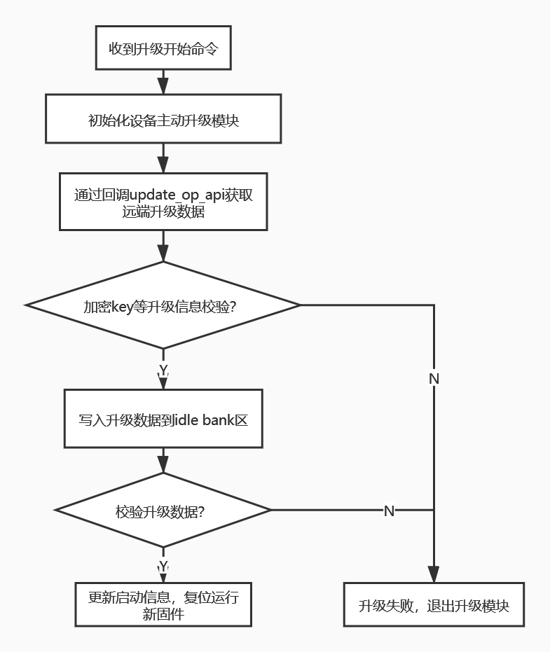
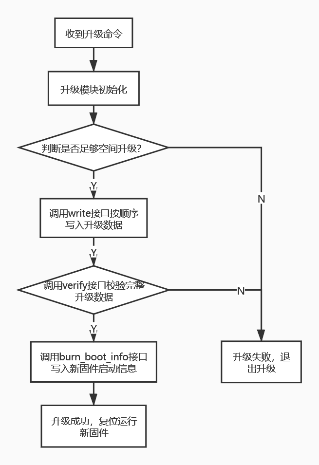

# 杰理双备份升级介绍
## 1. 双备份存储结构介绍
```
  ------------------
  - boot code      -
  ------------------
  - app code 0     -
  ------------------
  - app code 1     -
  ------------------
  - reserved area  -
  ------------------
```
  - 双备份存储结构有两个app code区域
  - 当运行app code 0时，升级时将新固件写入app code 1区域，反之亦然
  - 升级时对app code N区域数据校验成功后，更新启动标志，复位后即可运行app code N代码
  - 当升级中断或者新写入固件校验不成功，不会影响原来app code 的运行
  - 杰理双备份升级有两种方式实现
    - 设备主动升级（由设备端主动向远端获取升级数据，通信协议需要能支持文件内容获取能力）
    - 设备被动升级（由远端主动推送升级数据，设备端被动写入的方式，远端可控制升级流程）
 
## 2. 双备份升级流程
- 双备份设备主动升级流程图
<br/>
<div align="center">
  
</div>
<br/>

- 双备份设备被动升级流程图
<br/>
<div align="center">
  
</div>
<br/>

## 3. sdk相关配置
  - 在app_config.h里打开
 ```
 #define    CONFIG_DOUBLE_BANK_ENABLE 1
 ```
 - isd_config.ini需要加入如下配置
 ```
 BR22_TWS_DB=YES;	//dual bank flash framework enable
FLASH_SIZE=1M;		//flash_size cfg
BR22_TWS_VERSION=0; //default fw version

DB_UPDATE_DATA=YES; //generate db_update_data.bin
SPECIAL_OPT=0;
FORCE_4K_ALIGN=YES; // force aligin with 4k bytes
#NEW_FLASH_FS=YES;   //enable single bank flash framework  
 ```
 - 设备主动升级流程采用tools目录下的*.ufw文件作为升级文件，设备被动升级采用db_update_data.bin作为升级文件
## 4. API接口说明
- 设备主动升级API (update_loader_download.h)
```
/* *****************************************************************************/
/**                                                       
 * \Brief :        initializes the active update module v1 
 *                                                        
 * \Param :        update_type - which meida for getting update data 
 * \Param :        result_cbk - callback for update result handle
 * \Param :        cbk_priv - priv param for callback func
 * \Param :        p_op_api - remote file operation APIs  
 */                                                       
/* *****************************************************************************/
void app_update_loader_downloader_init(                   
    int update_type,                                      
    void (*result_cbk)(void *priv, u8 type, u8 cmd),      
    void *cbk_priv,                                       
    update_op_api_t *p_op_api);                           
                                                          
typedef struct _update_mode_info_t {                      
    s32 type;                                               //update type
    void (*state_cbk)(int type, u32 status, void *priv);    //callback for update state handle
    const update_op_api_t *p_op_api;                        //remote file operation APIs
    u8 task_en;                                             //enable/disable to create update task
} update_mode_info_t;                                     
                                                          
/* *****************************************************************************/
/**                                                       
 * \Brief :        initializes the active update module v2 
 *                                                        
 * \Param :        info - active update info structure    
 *                                                        
 * \Return :                                              
 */                                                       
/* *****************************************************************************/
int app_active_update_task_init(update_mode_info_t *info);                                          
```
- 设备被动升级API（dual_bank_passive_update.h）
```
/* @brief:Api for getting the buffer size for temporary storage
 */
u32 get_dual_bank_passive_update_max_buf(void);

/* @brief:Initializes the update task,and setting the crc value and file size of new fw;
 * @param fw_crc:crc value of new fw file
 * @param fw_size:total size of new fw file
 * @param priv:reserved
 * @param max_ptk_len: Supported maxium length of every programming,it decides the max size of programming every time
 */
u32 dual_bank_passive_update_init(u16 fw_crc, u32 fw_size, u16 max_pkt_len, void *priv);

/* @brief:exit the update task
 * @param priv:reserved
 */
u32 dual_bank_passive_update_exit(void *priv);

/* @brief:Judge whether enough space for new fw file
 * @note: it should be called after dual_bank_passive_update_init(...);
 * @param fw_size:fw size of new fw file
 */
u32 dual_bank_update_allow_check(u32 fw_size);


/* @brief:copy the data to temporary buffer and notify task to write non-volatile storage
 * @param data:the pointer to download data
 * @param len:the length to download data
 * @param write_complete_cb:callback for programming done,return 0 if no err occurred
*/
u32 dual_bank_update_write(void *data, u16 len, int (*write_complete_cb)(void *priv));

/* @brief: caculate all the data had flashed,and compare with the cre value intializeed when update init;
 * @crc_init_hdl:if it equals NULL,use internal implementation(CRC16-CCITT Standard);otherwise,use user's customization;
 * @crc_calc_hdl:if it equals NULL,use internal implementation(CRC16-CCITT Standard);otherwise,use user's customization;
 * @verify_result_hdl:when the verification completed,this callback for result notification;
 *                    if crc_res equals 1,crc verification passed,if 0,the verification failed.
*/
u32 dual_bank_update_verify(void (*crc_init_hdl)(void), u16(*crc_calc_hdl)(u16 init_crc, u8 *data, u32 len), int (*verify_result_hdl)(int crc_res));


/* @brief:After the new fw verification succeed,call this api to program the new boot info for new fw
 * @param burn_boot_info_result_hdl:this callback for error notification
 *                                  if err equals 0,the operate to burn boot info succeed,other value means to fail.
 */
u32 dual_bank_update_burn_boot_info(int (*burn_boot_info_result_hdl)(int err));

enum {

    CLEAR_APP_RUNNING_BANK = 0,
    CLEAR_APP_UPDATE_BANK,
};

/* @brief:this api for erasing the boot info of specific bank,it should be called much carefully
 * @param type:it decides which bank's boot info would be erased;
 *             clean the boot info of running bank and call system_reset,system will run the other bank if available;
 */
int flash_update_clr_boot_info(u8 type);

```
